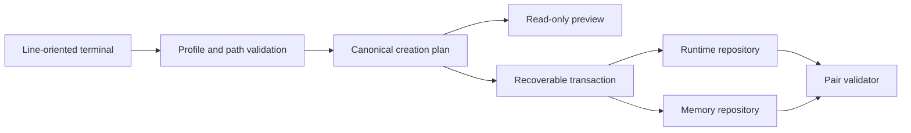

# Architecture

My Friday is a local native command that compiles normalized wizard answers
into one deterministic creation plan, previews it, and creates two separate
user-owned Git repositories. It has no service, database, network integration,
global installer, or background process.

| Component | Responsibility | Boundary |
|---|---|---|
| `cmd/my-friday` and `internal/terminal` | Commands and sequential prompts | No repository policy |
| `internal/profile` and `internal/plan` | NFC text, grapheme limits, IDs, files/actions, plan digest | Pure values; no I/O |
| `internal/repository` | Render, empty-template Git init, schema/Git validation | Git is the only subprocess |
| `internal/transaction` | Stage, validate, promote, roll back, recover | No overwrite of non-empty targets |

Runtime identity and governed memory share only a deterministic non-secret
assistant identifier. Absolute paths and plan IDs are not written into either
repository. Profile values remain JSON data and never enter generated Markdown
policy. See [repository bootstrap](architecture/repository-bootstrap.md) and
[ADR 0001](decisions/0001-native-bootstrap-command.md).
