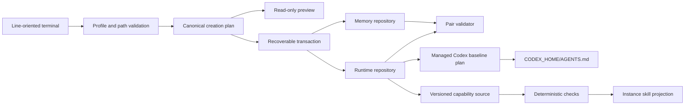

# Architecture

My Friday is a local native command that compiles normalized wizard answers
into deterministic, previewed plans. It creates two separate user-owned Git
repositories and can compose them into named, manifest-owned assistant
instances. It has no service, database, network integration, or background
process.

| Component | Responsibility | Boundary |
|---|---|---|
| `cmd/my-friday` and `internal/terminal` | Commands and sequential prompts | No repository policy |
| `internal/profile` and `internal/plan` | NFC text, grapheme limits, IDs, files/actions, plan digest | Pure values; no I/O |
| `internal/repository` | Render, empty-template Git init, schema/Git validation | Git is the only subprocess |
| `internal/transaction` | Stage, validate, promote, roll back, recover | No overwrite of non-empty targets |
| `internal/codexhome` | Inspect, preview, mutate, verify, and recover one projection | Authority limited to `AGENTS.md` and `.my-friday` |
| `internal/assistantinstance` | Create, verify, launch, remove, and recover named instances | One fixed private root plus one exact launcher leaf |
| `internal/capability` | Validate strict packages and manage copied skill projections | One named instance; no global skills, code, network, credentials, or dependencies |

Runtime identity and governed memory share only a deterministic non-secret
assistant identifier. Absolute paths and plan IDs are not written into either
repository. Profile values remain JSON data and never enter generated Markdown
policy. See [repository bootstrap](architecture/repository-bootstrap.md) and
[ADR 0001](decisions/0001-native-bootstrap-command.md). The installed-state
boundary is specified in [installed Codex baseline](architecture/installed-codex-baseline.md)
and [ADR 0002](decisions/0002-manifest-owned-codex-baseline.md).
The normal installed boundary is specified in [named assistant instances](architecture/named-assistant-instances.md)
and [ADR 0003](decisions/0003-native-named-assistant-launcher.md).
The source/projection lifecycle is specified in
[capability workshop](architecture/capability-workshop.md) and
[ADR 0004](decisions/0004-source-first-instruction-capabilities.md).
