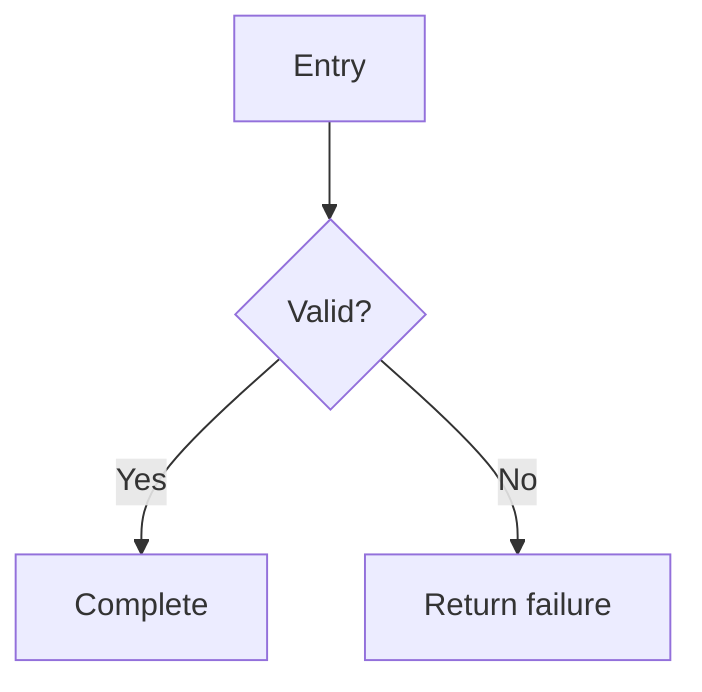
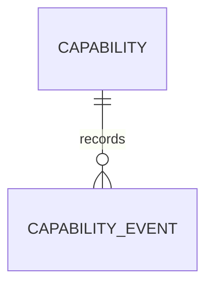

# Capability: Name

Use this template for a durable end-to-end capability. Replace this instruction
and remove sections that genuinely do not apply.

## Purpose And Scope

State what the capability does, who or what uses it, its entry and exit
boundaries, and explicit non-goals.

## Source Locations

| Concern | Path, schema, or symbol |
|---|---|
| Entry point | |
| Domain behavior | |
| Persistence | |
| Authorization | |
| Tests | |

## System Context

Name the participating components and external dependencies. Add a Mermaid
context diagram only when it clarifies a boundary or relationship.

## Behavior

State the diagram's scope, then cover success, validation, denial, failure,
retry, recovery, asynchronous work, and externally visible state transitions as
applicable.

Explain semantics and invariants that the diagram cannot express.

## State And Data Model

Describe ownership, lifecycle, retention, consistency, constraints, and
important indexes. Show only the shipped model; design-time
`existing`/`proposed` notation belongs in the issue history.

If no persistent state is involved, identify the existing source of state and
why it is sufficient.

## Interfaces And Contracts

| Surface | Consumer | Input | Output or event | Errors | Compatibility or idempotency |
|---|---|---|---|---|---|
| | | | | | |

Link authoritative OpenAPI, GraphQL, protobuf, database, or generated references
instead of duplicating them.

## Authorization And Data Exposure

| Subject | Action | Resource | Scope or condition | Denial behavior | Enforcement |
|---|---|---|---|---|---|
| | | | | | |

Cover background jobs, administrative powers, frontend visibility, sensitive
data, and audit evidence when applicable.

## Invariants

- State the conditions that must always remain true.
- Identify whether each is protected by a schema constraint, transaction,
  application rule, or external contract.

## Failure And Recovery

| Failure | Observable effect | Automatic handling | Operator or user recovery |
|---|---|---|---|
| | | | |

Link a runbook when recovery is recurring or operationally consequential.

## Operations And Observability

Record durable logs, metrics, alerts, queues, capacity boundaries, and health
signals. Keep environment-specific inventory in its live source.

## Related Decisions And Provenance

- ADR:
- Design issue:
- Other authoritative reference:
