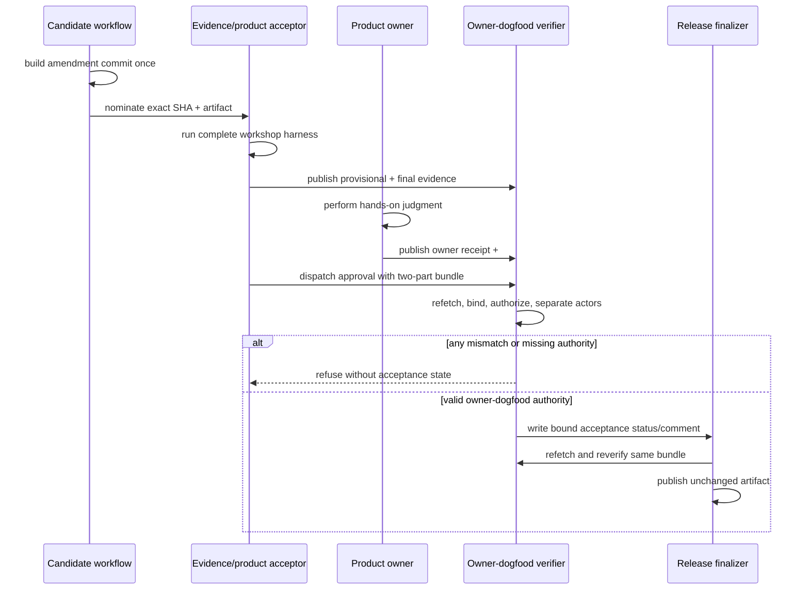

# Technical Design

## Component And Behavior Flow



The owner does not author the automated evidence, and the evidence actor does
not stand in for owner judgment. Both operate the same candidate/artifact. The
release finalizer trusts neither the earlier command exit nor an issue label;
it replays the authority against current immutable comments and the accepted
implementation set.

## State And Data Model

### Owner receipt comment

Marker:

```text
<!-- capability-workshop-owner-receipt-v1 -->
```

Strict JSON fields:

```json
{
  "schema": "capability-workshop-owner-receipt-v1",
  "issue": 51,
  "candidate": "<40-lowercase-hex>",
  "artifact": "artifact-v1:run=...:id=...:name=...:sha256=...",
  "role": "product-owner",
  "completion": true,
  "source_comprehension": true,
  "projection_comprehension": true,
  "recovery_needed": false,
  "retention_decision": "retain|remove",
  "acceptance_scope": "owner-operated-dogfood",
  "migration_evidence_issue": 92,
  "migration_evidence_due": "before-release",
  "independent_user_validation": "not-collected",
  "redacted": true
}
```

Unknown, missing, duplicate, wrong-type, or differently valued fields refuse.
The returned token contains only comment ID and SHA-256 of the exact marker plus
JSON body. Comment author is identity authority; no login is copied into JSON.

The migration fields are a plan, not completed evidence. They mean issue #92's
acceptance cannot claim the portable assistant outcome without fresh real-
migration proof before #92 release. They do not let the F0 verifier inspect or
approve future evidence.

### Bundle

The bundle has exactly two nonempty pipe-delimited parts:

```text
capability-workshop-owner-dogfood-v1:<capability-workshop-evidence-v1>|<capability-workshop-owner-receipt-v1>
```

Extra or missing delimiters refuse. Failure authority remains the existing
single `capability-workshop-failure-v1` token.

### Historical authority

`capability-workshop-acceptance-v1` and
`capability-workshop-partner-receipt-v1` remain immutable historical schemas.
Their verifiers may authenticate archived records, but active issue-51 approval
parsers and release parsers do not accept the old bundle prefix after this
change. Existing comments are never edited, deleted, or relabelled.

## Interfaces And Contracts

### Owner receipt recorder

A dedicated command avoids ambiguous optional arguments on the historical
partner recorder:

```text
GITHUB_REPOSITORY=OWNER/REPO \
PRODUCT_OWNER_ACTORS=<configured allowlist> \
bin/record-capability-workshop-owner-receipt \
  51 <full-sha> <artifact-v1> <retain|remove> 92
```

The recorder requires the current GitHub actor to be allowlisted, emits the
fixed plan fields, posts one comment, derives its digest token, then immediately
round-trips through the verifier with the expected current actor. It never
accepts free-form claims, profile text, credentials, transcripts, or a
different migration issue.

### Owner receipt verifier

```text
bin/verify-capability-workshop-owner-receipt \
  <token> 51 <full-sha> <artifact-v1> <expected-owner-or-empty>
```

It requires `GITHUB_REPOSITORY` and `PRODUCT_OWNER_ACTORS`, double-fetches the
comment, compares stable fields, verifies the body digest, marker, issue URL,
author, allowlist, and exact strict JSON. It returns the normalized owner actor.

### Bundle verifier

```text
bin/verify-capability-workshop-owner-dogfood \
  <bundle> 51 <full-sha> <artifact-v1> <evidence/product-acceptor>
```

It invokes the existing evidence verifier with the expected acceptor, invokes
the owner verifier, rejects equal normalized actors, resolves the lifecycle-
linked implementation PR set using the same grammar as product acceptance, and
rejects either role if it authored any merged implementation PR. Missing,
unmerged, malformed, or candidate-excluded implementation links already fail
through the product-acceptance layer and must remain failures.

The implementation should centralize the existing implementation-set
resolution only if needed to prevent disagreement between the bundle verifier,
`record-product-acceptance`, and `finalize-release`; it must not introduce a
general policy engine.

### Product acceptance

For issue 51:

- `approved` requires the new owner-dogfood prefix and verifier;
- `changes-required` requires the existing failure prefix and evidence
  verifier;
- retry-marker parsing recognizes the new success prefix and requires exact
  evidence equality; and
- `ACCEPTANCE_ACTORS` continues to authorize the workflow actor.

The workflow injects `PRODUCT_OWNER_ACTORS` from the repository Actions
variable of the same name.
The product summary must state owner-operated dogfood scope and may not state
independent-user validation.

### Release finalization

Successful marker parsing recognizes the new prefix. For issue 51,
`finalize-release` invokes the same owner-dogfood verifier with the recorded
acceptor and the same `PRODUCT_OWNER_ACTORS` injection. It retains nomination,
artifact digest, implementation digest, commit status, exact artifact download,
no-rebuild packaging, stable asset, checksum, tag, ledger, and retry checks.

The amendment implementation PR and candidate association must make #101 and
#51 lifecycle provenance explicit. The candidate is nominated only after the
implementation is merged to `main`; no verifier from a later control checkout
may authorize an older artifact.

## Authorization And Data Exposure

| Subject | Action/resource | Required authority | Denial/evidence |
|---|---|---|---|
| Evidence/product acceptor | Publish workshop evidence and approve candidate | `ACCEPTANCE_ACTORS`; not an implementation author; evidence comment author equals actor | Refuse before statuses/comment; redacted evidence only |
| Product owner | Publish owner judgment for exact candidate | `PRODUCT_OWNER_ACTORS`; not acceptor; not any implementation author | Refuse before/after post; strict redacted receipt |
| GitHub Actions | Record acceptance | Trusted default-branch workflow, exact nomination/checks/artifact/implementation set and valid bundle | No success statuses or accepted label |
| Release workflow | Publish artifact | Accepted exact candidate plus release-time bundle replay and existing release gate | No tag, Release, assets, ledger, or issue closure |
| Later external user | Supply independent-usability evidence | No authority exists in this change | No product or release claim is granted |

Repository variables contain GitHub login names only, not credentials. GitHub's
workflow token remains the sole API credential and retains current least-
privilege permissions. Receipt content is public because the repository is
public; it therefore contains no paths, source, transcripts, personal profile,
credentials, or migration content.

## Failure, Recovery, And Observability

- A recorder post followed by local verification failure leaves a non-authority
  comment unless its token can later pass exact verification. Do not edit it;
  diagnose and post a new receipt.
- A changed or deleted comment fails stable fetch/digest validation at
  acceptance or release. Historical acceptance status cannot bypass replay.
- A missing owner variable or owner not in the allowlist fails with a stable,
  non-secret configuration error.
- Candidate, artifact, issue, author, role, migration plan, or implementation-
  set mismatch fails before any product-acceptance state change.
- A rejected hands-on journey uses existing failure authority and returns the
  candidate for correction. It never creates an approving owner receipt.
- If acceptance succeeds but release fails, ordinary retry reuses only the same
  candidate, artifact, implementation digest, acceptor, and bundle. A changed
  candidate requires fresh evidence and owner judgment.
- Release rollback retains the preceding GitHub Release and artifact. No
  automated rollback rewrites issue evidence or mutable branch history.
- Logs name stable failure class and affected authority component, never comment
  bodies or credential material. The issue's typed comments, workflow run,
  statuses, tag, Release, checksums, and ledger remain the audit trail.

## Design Traceability

| Issue #101 criterion | Design proof |
|---|---|
| Owner judgment + automated evidence + migration plan | Two-part bundle, strict owner receipt, fixed issue-92 plan fields |
| No two design-partner requirement | Active success parser accepts only owner-dogfood bundle |
| Controlled accounts not independent users | No active independent-user role or claim; acceptor/owner roles explicitly named and separated |
| Docs distinguish scopes | Deployment, security, development, and product copy promotion |
| Existing integrity and rollback retained | Existing evidence verifier, nomination/status/finalizer/artifact path unchanged and replayed |
| Old contract fails/new passes and invalid inputs refuse | Failing-first parser, schema, actor, candidate, artifact, implementation, edit, and release symmetry tests |
