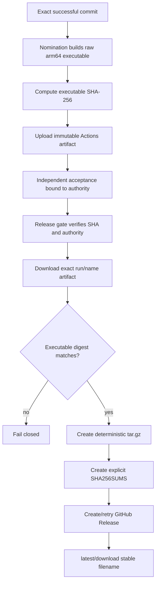

# Technical Design

## Component And Behavior Flow

The nomination authority string identifies the workflow run, Actions artifact
ID/name, and executable SHA-256. Release parses that closed format rather than
accepting a caller-selected path. A small packaging script owns reproducible
archive creation and checksum output. `bin/finalize-release` owns idempotent
GitHub asset publication after existing issue/release authority checks.

## State And Data Model

The immutable identities are:

- application commit SHA;
- Actions run ID plus artifact ID/name;
- accepted executable SHA-256;
- deterministic archive SHA-256;
- GitHub release tag and asset IDs.

The accepted artifact authority remains a source-controlled string carried
through nomination, acceptance, release gating, and release notes. The archive
checksum is derived after the executable proof and is recorded in
`SHA256SUMS`. Neither identity is overwritten or reused for the other.

The current-release backfill accepts an explicit release tag and existing
commit-suffixed archive name. It downloads both the archive and `SHA256SUMS`,
verifies the archive digest, extracts into a temporary directory with safe-path
checks, verifies the one executable against the ledger digest, and uploads the
unchanged archive bytes under the stable filename.

## Interfaces And Contracts

- Nomination emits an authority of a strict versioned shape containing run,
  artifact ID/name, and `sha256:<64 lowercase hex>` executable digest.
- The uploaded Actions artifact contains exactly one regular executable file;
  symlinks, extra entries, unsafe paths, and size ambiguity are rejected.
- The release workflow downloads only the nominated run/artifact, verifies the
  accepted digest, and calls the packaging/finalization scripts. It never runs
  the compiler.
- `my-friday-darwin-arm64.tar.gz` contains exactly `my-friday` with normalized
  metadata and the accepted bytes.
- `SHA256SUMS` has unambiguous labelled entries for the public archive and
  contained executable; parsers require exact filenames and one entry each.
- Finalization creates a missing asset, treats an existing equal-digest asset
  as success, and fails on an existing differing asset. A partially created
  release is resumable without duplicating notes or issue state.
- Backfill is a separately authorized manual workflow/command pinned to the
  exact current tag and assets. It refuses drafts, prereleases, a tag that is no
  longer latest, or any digest/content mismatch.

## Authorization And Data Exposure

GitHub Actions receives `contents: write` only in release/backfill jobs that
upload assets; nomination remains `contents: read` plus its existing evidence
permissions. `GITHUB_TOKEN` stays inside Actions. Public outputs are executable
and archive checksums, provenance already present in release evidence, and
download assets; no credentials or user data are introduced.

## Failure, Recovery, And Observability

- Missing/expired Actions artifacts, malformed authority, checksum mismatch,
  unsafe archive content, multiple files, or a mismatched existing stable asset
  terminate before publication.
- If release creation succeeds but asset upload is interrupted, retry rechecks
  the release ledger and every existing asset digest before adding only missing
  items.
- Backfill retains original assets. If a verified operational error is found,
  only the stable alias is deleted by exact asset ID/name; source archive,
  checksums, tag, notes, and accepted evidence remain.
- Workflow summaries and release notes record the two digests and source
  identity without exposing tokens or temporary paths.

## Design Traceability

The constant filename supplies the permanent URL; accepted artifact download
and executable verification preserve byte authority; deterministic packaging
and archive digest establish repeatability; idempotent finalization covers
retry; strict backfill covers the current release; the checksum file and docs
make both layers publicly verifiable; deletion by exact stable asset provides
bounded recovery.
