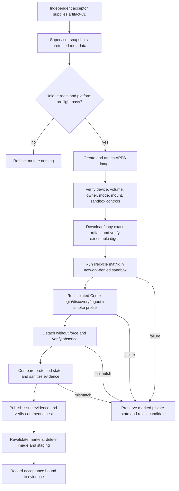

# Technical Design

## Component And Behavior Flow



The supervisor, not the candidate, owns setup, monitoring, evidence, and
cleanup. Candidate processes are invoked directly, with a PTY where the CLI
contract requires confirmation; shell wrappers do not expand paths or secrets.

## State And Data Model

### Run roots and identity

For a cryptographically random run ID, the supervisor requires these exact
absent children of the accepting user's canonical real home:

- `.my-friday-acceptance/<run-id>/`: mode `0700`, containing the image backing
  file, an empty mountpoint, supervisor marker, private profiles, and private
  manifests;
- `.my-friday-acceptance-evidence/<run-id>/`: mode `0700`, containing only the
  sanitized evidence draft and publication receipt.

Before mutation it opens each parent without following symlinks and proves
local APFS, current owner, non-root location, expected parent identity, and no
pre-existing child. The marker records schema, run ID, canonical real home,
UID/GID, creation time, parent and child device/inode, and random nonce. Every
later mutation reopens fd-relative with no-follow semantics and revalidates
regular-file/directory type, single-link expectation where applicable,
owner/mode, allowlisted ancestry, device/inode, and marker nonce.

### Volume authority

Create a sparse APFS image with no overwrite. Attach with an explicit marked
mountpoint, `-nobrowse`, and ownership enabled, requesting program-readable
output. Parse and retain the exact whole/device node, volume UUID, mount path,
backing-image device/inode, filesystem, mount owner, and options. Refuse extra
unexpected mounted entities, non-APFS/nonlocal filesystems, symlinked paths,
wrong ownership/mode, or disagreement between `hdiutil` output and the mount
table.

The volume contains:

```text
home/                     synthetic HOME
home/.codex/              synthetic CODEX_HOME, including temporary auth.json
tmp/                      TMPDIR
xdg-cache/ xdg-config/    synthetic XDG roots
fixtures/                  runtime sources and collision/drift fixtures
candidate/                 exact nominated executable and archive receipt
```

### Sandbox authority

Profiles use `(deny default)` and permit only the process, signal, system-read,
device, and terminal operations proven necessary. File writes are allowlisted
to the exact resolved volume root and evidence staging root; no broader home,
temporary, or device write rule is allowed. Candidate processes inherit the
profile across descendants.

Two reviewed profiles exist:

- **lifecycle:** denies all network operations;
- **Codex smoke:** retains identical file-write restrictions and allows only the
  network operations/endpoints necessary for authenticated standard-provider
  Codex execution.

The generated profile is derived from fixed templates plus escaped canonical
paths, UID, and run identifiers. Its SHA-256 and platform build enter evidence.
Before candidate execution the supervisor proves: allowed volume write succeeds,
allowed evidence write succeeds, a write to a non-sensitive protected canary is
denied and unchanged, unsandboxed reachability control succeeds, sandboxed
lifecycle reachability fails, and smoke-profile reachability succeeds. Nonzero
exit, parser diagnostics, unexpected stderr, missing binary, or normalized
profile/rule mismatch refuses acceptance. Deprecation warnings explicitly
reviewed and allowlisted for the supported build may be recorded; new warnings
are failures.

### Protected-state manifests

Before setup and after verified detach, the supervisor walks allowlisted
protected roots that cover the real effective `CODEX_HOME`, its relevant parent
entries, and the deployed runtime projection. It excludes only the exact marked
run/evidence subtrees. The private manifest records relative name, entry type,
device/inode, link count, UID/GID, mode, flags, size, and timestamps. It never
reads or hashes secret file contents. A dedicated non-sensitive canary records
content digest as active write-denial proof.

Published evidence contains only schema version, manifest aggregate digest,
entry count, equality result, and canary identities expressed as stable test
labels—not private paths or entries. Any traversal error, race, unsupported
entry, or pre/post difference rejects acceptance and preserves private evidence.

### Evidence authority

The sanitized Markdown record includes issue, candidate SHA, complete
`artifact-v1` authority, executable digest, acceptance-harness commit, accepting
OS/hardware/filesystem, profile digests, control outcomes, matrix outcomes,
aggregate protected-state equality, volume/device detach proof, cleanup plan,
Codex smoke result, and a redaction assertion. It includes no environment dump,
secret, `auth.json`, raw manifest, private path, or command transcript capable
of containing prompts/provider output.

Publish the record as a new issue #4 comment. Record its immutable comment ID,
URL, author, creation time, and SHA-256 of the fetched exact body. Acceptance
fetches it again and requires expected acceptor author, issue, candidate,
artifact, schema marker, and body digest. The acceptance marker/status includes
the evidence comment ID and digest. Release fetches the comment by ID and
revalidates the digest and bindings; edit, deletion, or mismatch fails closed.

## Interfaces And Contracts

### Local acceptance command

`bin/accept-installed-codex-baseline <artifact-v1 authority> <issue-number>` is
an interactive, macOS-only supervisor. It:

1. requires issue `4`, current independent GitHub actor, supported arm64 macOS,
   APFS/Git/Codex prerequisites, a TTY, an approved secret source reference, and
   no administrator/root execution;
2. downloads the named GitHub Actions artifact by recorded run/name/ID, verifies
   archive and executable structure, copies it to the volume, and re-verifies
   the authority's executable SHA-256 before every scenario group;
3. runs the matrix and emits structured private results plus one sanitized
   evidence document;
4. publishes and re-fetches the evidence comment; and
5. cleans only after detach, protected-state equality, publication, and full
   marker revalidation.

Exit classes distinguish unsupported/refused preflight, candidate behavior
failure, containment/protected-state failure, evidence publication failure, and
cleanup-preserved-for-diagnosis. A failed run never records approval.

### Candidate environment

Every lifecycle invocation receives a minimal environment with synthetic
`HOME`, `CODEX_HOME`, `TMPDIR`, XDG paths, fixed locale, explicit `PATH`, and
fixture/runtime variables. The supervisor rejects inherited My Friday/Codex
configuration channels not on the allowlist. It never points any lifecycle
command at the real `~/.codex` or deployed runtime source/projection.

For the real-Codex smoke, the operator-approved secret is read/injected without
printing, then piped on stdin to `codex login --with-api-key` under the smoke
profile. The resulting `auth.json` is permitted only inside the image and is
classified sensitive disposable state. The smoke runs a fixed sanitized prompt
that proves a unique fixture instruction from installed `AGENTS.md` was
discovered, stores only a boolean/expected token, runs `codex logout`, and
destroys remaining auth state with the volume. No claim of zero temporary
persistence is made.

### Interruption contract

The supervisor starts an ordinary mutating command using the exact candidate,
then reads only its tool-owned transaction journal on the disposable volume.
After observing a selected durable ordinary phase and validating the journal
schema/run context, it sends `SIGKILL` to that candidate PID/process group. It
waits for death, proves `verify` reports recovery required, invokes ordinary
`recover --transaction <synthetic path>`, and verifies the resulting generation.
No test hook, fault flag, patched binary, or special production behavior exists.

### Lifecycle matrix

The matrix covers preview/cancel, fresh install, repeat verify, foreign
collision refusal, drift detection and repair without rotating drift into
rollback authority, upgrade from a changed runtime generation, rollback,
source-missing source-independent verify/rollback/uninstall behavior, externally
interrupted install/upgrade/uninstall recovery at representative durable phases,
uninstall, repeat not-installed verification, and preservation of unrelated
canaries. Each scenario starts from a declared fixture state and checks exit
class, structured status, exact file/control state, generation authority, and
prohibited effects.

## Authorization And Data Exposure

| Subject | Action/resource | Authority and denial |
| --- | --- | --- |
| Acceptor | Run supervisor and publish evidence | Ordinary user plus GitHub issue-comment authority; root/sudo refuses |
| Supervisor | Create/mount/detach/delete marked run | Exact canonical paths, marker, device/inode/owner/mode proof; mismatch preserves |
| Candidate | Mutate synthetic Codex home | Sandbox write allowlist only; lifecycle network denied |
| Real Codex | Login and execute smoke | Temporary stdin secret, image-local auth state, smoke-only network |
| Acceptance workflow | Record issue approval | Exact candidate/artifact/implementation set plus fetched evidence ID/digest/author |
| Release workflow | Publish bytes | Same accepted artifact and still-valid evidence authority |

The same UID is not a separate confidentiality principal. System and same-user
reads needed by the processes may remain possible, and the user's login
keychain is not fresh. The design's claims are limited to write containment,
network denial where named, exact-byte behavior, protected-state equality, and
cleanup. Credentials/elevation are never passed to My Friday.

## Failure, Recovery, And Observability

All failures are fail-closed. Before mount, cleanup removes only an empty,
newly marked run. After mount, a failure stops children, syncs, attempts ordinary
non-forced detach, and preserves the private run/evidence directories unless
all identities and protected state are proven. If detach fails, the image and
mount remain for a printed exact diagnostic command; the supervisor never uses
`-force` automatically.

Cleanup requires no candidate child, successful logout attempt, sync, exact
device/volume/mount agreement, ordinary detach, absence from both `hdiutil`
program-readable state and mount tables, empty expected mountpoint, unchanged
image identity, protected-state equality, and revalidated run/evidence markers.
It then unlinks only the exact image and expected files fd-relative, removes
only empty exact directories, and verifies both roots absent. Unexpected entries
or identity drift are retained.

Private logs use fixed event names and redacted fields. Sanitization rejects
secret-shaped material and unapproved paths before publication. Evidence
publication failure preserves the sanitized draft locally; acceptance remains
blocked. Host crash recovery is an explicit runbook operation that discovers
only exact schema markers beneath the fixed parents and repeats the same
identity/detach/deletion proofs.

## Design Traceability

| Acceptance group | Component/state | Authority | Recovery/evidence |
| --- | --- | --- | --- |
| Protect live installation | APFS roots, sandbox, manifests, canaries | Marker + sandbox write allowlist | Refuse or preserve; aggregate equality proof |
| Exact candidate | Artifact downloader and volume copy | `artifact-v1` digest | Reverify before groups; reject mismatch |
| Full lifecycle | Fixture/matrix runner | Synthetic HOME/CODEX_HOME | Exact state/results in sanitized record |
| Interruption | Journal observer and external `SIGKILL` | Candidate PID + ordinary journal phase | Production `recover`; no fault build |
| Real Codex discovery | Smoke profile and image auth state | Approved secret injection; smoke-only network | Logout and image destruction |
| No-admin cleanup | APFS supervisor | Ordinary UID, marker/device/inode proof | Non-force detach, mismatch preservation |
| Durable acceptance/release | Evidence comment binding | Comment ID/body digest/actor/candidate | Edited/deleted evidence blocks release |
