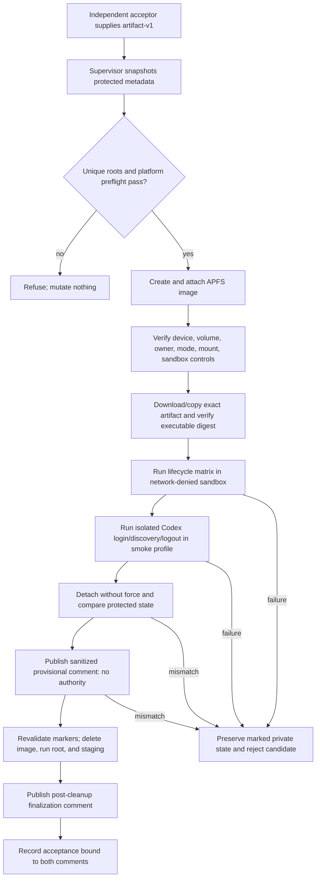

# Technical Design

## Component And Behavior Flow



The supervisor, not the candidate, owns setup, monitoring, evidence, and
cleanup. Candidate processes are invoked directly, with a PTY where the CLI
contract requires confirmation; shell wrappers do not expand paths or secrets.

## State And Data Model

### Run roots and identity

For a cryptographically random run ID, the supervisor requires these exact
absent children of the accepting user's canonical real home:

- `.my-friday-acceptance/<run-id>/`: mode `0700`, containing the image backing
  file, an empty mountpoint, supervisor marker, private profiles, and private
  manifests;
- `.my-friday-acceptance-evidence/<run-id>/`: mode `0700`, supervisor-owned and
  outside every candidate sandbox write allowlist, containing only the sanitized
  evidence draft and publication receipt.

Before mutation it opens each parent without following symlinks and proves
local APFS, current owner, non-root location, expected parent identity, and no
pre-existing child. The marker records schema, run ID, canonical real home,
UID/GID, creation time, parent and child device/inode, and random nonce. Every
later mutation reopens fd-relative with no-follow semantics and revalidates
regular-file/directory type, single-link expectation where applicable,
owner/mode, allowlisted ancestry, device/inode, and marker nonce.

### Volume authority

Create a sparse APFS image with no overwrite. Attach with an explicit marked
mountpoint, `-nobrowse`, and ownership enabled, requesting program-readable
output. Parse and retain the exact whole/device node, volume UUID, mount path,
backing-image device/inode, filesystem, mount owner, and options. Refuse extra
unexpected mounted entities, non-APFS/nonlocal filesystems, symlinked paths,
wrong ownership/mode, or disagreement between `hdiutil` output and the mount
table.

The volume contains:

```text
home/                     synthetic HOME
home/.codex/              synthetic CODEX_HOME, including temporary auth.json
tmp/                      TMPDIR
xdg-cache/ xdg-config/    synthetic XDG roots
fixtures/                  runtime sources and collision/drift fixtures
candidate/                 exact nominated executable and archive receipt
```

### Sandbox authority

Profiles use `(deny default)` and permit only the process, system-read, device,
and terminal operations proven necessary. Candidate persistent file writes are
allowlisted only to the exact resolved volume root; evidence staging and every
broader home, temporary, or device write location remain denied. Candidate
processes inherit the profile across descendants. Only the trusted supervisor,
running outside that sandbox after validating structured results, may write
sanitized evidence staging. Fixed inherited PTY/pipe descriptors may carry
candidate output to the supervisor, but do not grant a named filesystem target.

Candidate signal authority is denied except for an exact reviewed
`(target self)` rule if a proven runtime requirement needs self-signaling; there
is no broad `(allow signal)`. The unsandboxed supervisor creates a new session/
process group for each invocation, records leader PID/start identity and PGID,
and alone may stop, continue, or kill that exact group after revalidation. The
profile is inherited by every `exec` descendant. A control descendant repeats
the file, network, and signal denials so an executable transition cannot escape.
An unrelated same-UID sentinel outside the group must retain its heartbeat and
signal state when the candidate probe attempts to signal it.

Two reviewed profiles exist:

- **lifecycle:** denies all network operations;
- **Codex smoke:** retains identical file-write restrictions but permits broad
  outbound network only for the fixed, time-bounded real-Codex
  login/exec/logout sequence. It does not claim endpoint-level or unrelated-
  egress denial because the repository owns no stable provider address/resolver
  grammar.

The generated profile is derived from fixed templates plus escaped canonical
paths, UID, and run identifiers. Its SHA-256 and platform build enter evidence.
Before candidate execution a fixed candidate-like probe proves: allowed volume
write succeeds, evidence-staging write is denied, a write to a non-sensitive
protected canary is denied and unchanged, unsandboxed reachability control
succeeds and sandboxed lifecycle reachability fails. The smoke profile proves
only that the standard provider sequence can run; it does not use an unrelated-
egress negative control or infer endpoint restriction. The supervisor separately
proves it can create its sanitized evidence
file without granting that path to candidate descendants. Nonzero
exit, parser diagnostics, unexpected stderr, missing binary, or normalized
profile/rule mismatch refuses acceptance. Deprecation warnings explicitly
reviewed and allowlisted for the supported build may be recorded; new warnings
are failures.

### Protected-state manifests

Before setup and after verified detach, the supervisor walks allowlisted
protected roots that cover the real effective `CODEX_HOME`, its relevant parent
entries, and the deployed runtime projection. It excludes only the exact marked
run/evidence subtrees. The private metadata manifest records relative name,
entry type, device/inode, link count, UID/GID, mode, flags, size, and modification/
change timestamps, but not access time.

A separate reviewed content allowlist hashes the exact bytes of non-sensitive
live managed artifacts only: recognized manifest-owned `AGENTS.md` and schema-
known `.my-friday` control regular files after ownership/type/no-follow proof,
the deployed runtime's explicitly documented non-secret projection files, and
dedicated non-sensitive canaries. Foreign entries, credential/auth files,
configuration with unknown sensitivity, and every other protected file are
metadata-only and their contents are never opened.

Published evidence reports two narrow results: metadata equality for the full
protected inventory, and byte-digest equality for the non-sensitive content
allowlist/canaries. It contains only schema version, aggregate digests, counts,
equality booleans, and stable test labels—not private paths or entries. Any
traversal error, race, unsupported entry, metadata difference, or allowlisted
content difference rejects acceptance and preserves private evidence. The plan
does not claim byte equality for metadata-only secret-bearing entries.

### Evidence authority

The sanitized provisional record includes issue, candidate SHA, complete
`artifact-v1` authority, executable digest, clean-checkout tree and supervisor/
profile blob IDs and digests, accepting OS/hardware/filesystem, profile digests,
control outcomes, matrix outcomes, split protected-state results, volume/device
detach proof, expected cleanup set, Codex smoke result, limitations, and a
redaction assertion. It includes no environment dump, secret, `auth.json`, raw
manifest, private path, or transcript capable of containing prompts/provider
output.

Evidence uses two tamper-evident GitHub comments:

1. After ordinary detach and protected-state comparison, publish the sanitized
   **provisional** record. Its schema marker explicitly says
   `authority=provisional`; it can never satisfy acceptance or release. Fetch it
   by immutable comment ID and record author, creation time, and body SHA-256.
2. Revalidate identities, delete the exact image/run root and supervisor-owned
   evidence staging, and prove both fixed parents have no run-ID child. Then
   publish a small **finalization** record directly from supervisor memory. It
   contains the provisional comment ID/digest, exact post-cleanup assertions,
   protected-state result, candidate/artifact, and `authority=final`.

Acceptance fetches both comments by ID and requires expected acceptor author,
issue, candidate, artifact, schema markers, exact body digests, cross-reference,
and final cleanup assertions. Its marker/status includes both IDs/digests.
Release re-fetches both; edit, deletion, author/binding mismatch, or a lone
provisional comment fails closed. If finalization publication fails after local
cleanup, no acceptance authority exists and the run must be repeated.

## Interfaces And Contracts

### Local acceptance command

`bin/accept-installed-codex-baseline <artifact-v1 authority> <issue-number>` is
an interactive, macOS-only supervisor. It:

1. requires issue `4`, current independent GitHub actor, supported arm64 macOS,
   APFS/Git/Codex prerequisites, a TTY, an approved secret source reference, and
   no administrator/root execution; it runs as the checked-in path from a fresh
   checkout whose `HEAD` exactly equals the nominated candidate, origin matches
   this repository, porcelain status including untracked files is empty, and
   supervisor/profile bytes match their `HEAD` tree/blob objects and digests;
2. downloads the named GitHub Actions artifact by recorded run/name/ID, verifies
   archive and executable structure, copies it to the volume, and re-verifies
   the authority's executable SHA-256 before every scenario group;
3. runs the matrix and emits structured private results plus a sanitized
   provisional document;
4. publishes and re-fetches the no-authority provisional comment;
5. performs full marker-bound local cleanup and verifies absence; and
6. publishes/re-fetches finalization from memory and binds both records.

Exit classes distinguish unsupported/refused preflight, candidate behavior
failure, containment/protected-state failure, evidence publication failure, and
cleanup-preserved-for-diagnosis. A failed run never records approval.

### Candidate environment

Every lifecycle invocation receives a minimal environment with synthetic
`HOME`, `CODEX_HOME`, `TMPDIR`, XDG paths, fixed locale, explicit `PATH`, and
fixture/runtime variables. The supervisor rejects inherited My Friday/Codex
configuration channels not on the allowlist. It never points any lifecycle
command at the real `~/.codex` or deployed runtime source/projection.

For the real-Codex smoke, the operator-approved secret is read/injected without
printing, then piped on stdin to `codex login --with-api-key` under the smoke
profile. The resulting `auth.json` is permitted only inside the image and is
classified sensitive disposable state. The smoke runs a fixed sanitized prompt
that proves a unique fixture instruction from installed `AGENTS.md` was
discovered, stores only a boolean/expected token, runs `codex logout`, and
destroys remaining auth state with the volume. No claim of zero temporary
persistence is made.

### Interruption contract

The supervisor runs each interruption case against a fresh large ordinary
fixture so production work lasts long enough to observe, but it never assumes
polling saw a stable phase. It repeatedly sends `SIGSTOP` to the exact candidate
process group and waits until the OS proves every surviving member stopped.
Only behind that external barrier may it open the tool-owned journal/staged
entries fd-relative and decide whether the stopped state is schema-valid,
transaction-linked, and recoverable. If too early, it resumes and tries again;
if the process completed, the state advanced beyond proof, or a fixed attempt/
time bound expires, that attempt confers no evidence and restarts from a fresh
fixture up to a fixed run bound.

When and only when a stopped state proves an active recoverable transaction, the
supervisor records the stable journal/generation facts and sends `SIGKILL` while
the group remains stopped. It waits for death, proves the journal and filesystem
still match the captured interrupted state, proves `verify` reports recovery
required, invokes ordinary `recover --transaction <synthetic path>`, and verifies
the resulting generation. Acceptance requires a proven interrupted/recovered
case for install, upgrade, and uninstall; it claims operation-kind coverage, not
capture of an exact named phase. No test hook, fault flag, patched binary, or
special production behavior exists.

### Lifecycle matrix

The matrix covers preview/cancel, fresh install, repeat verify, foreign
collision refusal, drift detection and repair without rotating drift into
rollback authority, upgrade from a changed runtime generation, rollback,
source-missing source-independent verify/rollback/uninstall behavior, externally
interrupted install/upgrade/uninstall recovery in barrier-proven durable states,
uninstall, repeat not-installed verification, and preservation of unrelated
canaries. Each scenario starts from a declared fixture state and checks exit
class, structured status, exact file/control state, generation authority, and
prohibited effects.

## Authorization And Data Exposure

| Subject | Action/resource | Authority and denial |
| --- | --- | --- |
| Acceptor | Run supervisor and publish evidence | Ordinary user plus GitHub issue-comment authority; root/sudo refuses |
| Supervisor | Create/mount/detach/delete marked run | Exact canonical paths, marker, device/inode/owner/mode proof; mismatch preserves |
| Candidate | Mutate synthetic Codex home | Sandbox allows writes only on disposable volume, at most self-targeted signal, evidence/live roots and lifecycle network denied |
| Real Codex | Login and execute smoke | Temporary stdin secret, image-local auth state, broad outbound network only during fixed smoke |
| Acceptance workflow | Record issue approval | Exact candidate/artifact/implementation set plus fetched provisional/final IDs/digests/authors |
| Release workflow | Publish bytes | Same accepted artifact and still-valid evidence authority |

The same UID is not a separate confidentiality principal. System and same-user
reads needed by the processes may remain possible, and the user's login
keychain is not fresh. The design's claims are limited to write containment,
network denial for lifecycle scenarios, exact-byte behavior, metadata equality
for the protected inventory, byte equality for the non-sensitive content
allowlist, and cleanup. Smoke egress is not endpoint-restricted. Credentials/
elevation are never passed to My Friday.

## Failure, Recovery, And Observability

All failures are fail-closed. Before mount, cleanup removes only an empty,
newly marked run. After mount, a failure revalidates and stops only the dedicated
candidate group, enumerates its members, proves every recorded child exited,
syncs, attempts ordinary
non-forced detach, and preserves the private run/evidence directories unless
all identities and protected state are proven. If detach fails, the image and
mount remain for a printed exact diagnostic command; the supervisor never uses
`-force` automatically.

Cleanup requires an empty candidate process group with no escaped or unknown
child, successful logout attempt, sync, exact
device/volume/mount agreement, ordinary detach, absence from both `hdiutil`
program-readable state and mount tables, empty expected mountpoint, unchanged
image identity, protected-state equality, and revalidated run/evidence markers.
It then unlinks only the exact image and expected files fd-relative, removes
only empty exact run and evidence directories, and verifies both run-ID children
absent before finalization publication. Unexpected entries or identity drift are
retained.

Private logs use fixed event names and redacted fields. Sanitization rejects
secret-shaped material and unapproved paths before provisional publication. A
provisional publication failure preserves the sanitized draft locally; a
finalization failure after verified cleanup leaves only a no-authority
provisional comment and requires a fresh run. Host crash recovery is an explicit runbook operation that discovers
only exact schema markers beneath the fixed parents and repeats the same
identity/detach/deletion proofs.

## Design Traceability

| Acceptance group | Component/state | Authority | Recovery/evidence |
| --- | --- | --- | --- |
| Protect live installation | APFS roots, sandbox, split manifests, canaries | Marker + sandbox write allowlist | Metadata inventory plus allowlisted content equality |
| Exact candidate | Artifact downloader and volume copy | `artifact-v1` digest | Reverify before groups; reject mismatch |
| Full lifecycle | Fixture/matrix runner | Synthetic HOME/CODEX_HOME | Exact state/results in sanitized record |
| Interruption | External stop barrier, stable journal proof, then `SIGKILL` | Stopped candidate group + ordinary recoverable state | Production `recover`; bounded retry, no fault build |
| Real Codex discovery | Smoke profile and image auth state | Approved secret injection; time-bounded broad smoke network | Logout and image destruction; no endpoint claim |
| No-admin cleanup | APFS supervisor | Ordinary UID, marker/device/inode proof | Non-force detach, mismatch preservation |
| Durable acceptance/release | Provisional plus post-cleanup finalization binding | Both IDs/body digests/actor/candidate | Provisional alone or edited/deleted evidence blocks release |
