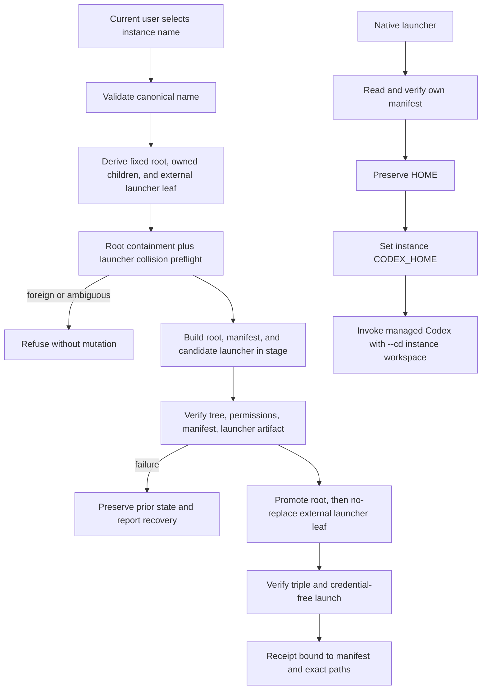

# Technical Design

## Component And Behavior Flow



Creation, verification, launch, inspection, recovery, and removal accept a name,
not an arbitrary root. Path derivation is internal. Every mutating operation
revalidates the canonical root, manifest, owned relative paths, exact external
launcher leaf, and relevant filesystem identity immediately before mutation.
The sole permitted namespace change outside the root is creation, verified
replacement, or removal of `$HOME/.local/bin/<name>`; the parent must pre-exist
and is never created, chmodded, edited, or adopted.

Migration adds a gated branch: validate the prior O2 manifest, construct a
source ownership snapshot, classify the external launcher leaf as absent,
foreign, or exactly prior-owned, create and verify the new named root without
deleting the source, promote it, install or exactly replace the launcher,
verify the root/manifest/launcher triple from final paths, and only then execute
the exact prior-manifest cleanup plan. Failure before cleanup leaves the prior
projection intact or restores its exact verified launcher artifact; cleanup
interruption records sufficient manifest state to resume only the same proven
plan.

## State And Data Model

```text
$HOME/.my-friday/assistants/<name>/
├── manifest.json
├── codex/
├── runtime/
├── memory/
├── workspace/
└── dependencies/

$HOME/.local/bin/<name>  # sole external manifest-owned projection
```

The concrete serialization may follow the repository's existing manifest
format, but it must represent these semantics:

| Field | Contract |
|---|---|
| schema | Versioned named-instance schema; unknown versions fail closed |
| name | Canonical validated name equal to the directory basename |
| root | Canonical absolute root derived from real `HOME`, never caller-selected |
| root-owned paths | Fixed relative entries only; no absolute or parent traversal |
| external launcher | Exact derived `$HOME/.local/bin/<name>` absolute path, regular-file type, executable mode contract, and generated-artifact identity |
| lifecycle state | staged, active, recovery-required, or removal-planned |
| migration source | Optional prior schema/manifest identity and exact proven cleanup paths |

Credential contents, tokens, arbitrary environment variables, shell commands,
and unrelated home paths are forbidden manifest data. The launcher is the only
absolute managed path and must equal the canonical value derived from real
`HOME` plus canonical instance name; a manifest cannot nominate another path.

Names use a conservative canonical ASCII grammar selected in implementation:
lowercase alphanumeric segments with bounded interior hyphens, bounded length,
and an explicit reserved-name list. Input must already be canonical; there is
no silent case or Unicode normalization. This makes names, launcher paths, and
collision behavior stable on default case-insensitive macOS filesystems.

All root-owned children remain descendants of the canonical instance root. The
sole exception is the external launcher leaf; it and every relevant ancestor
must pass no-symlink, canonical-owner, type, and collision checks at creation,
verification, mutation, and cleanup. Permissions follow current-user-only
defaults appropriate to possible Codex credential material. Removal verifies
and removes only the exact external launcher artifact and the manifest's fixed
root-relative paths, refusing unexpected mount, symlink, ownership, schema, or
artifact changes.

## Interfaces And Contracts

The implementation should extend the native CLI with one cohesive `assistant`
capability. Exact spelling may follow current command conventions, while
preserving these operations:

| Operation | Input | Success | Stable refusal/recovery classes |
|---|---|---|---|
| create | canonical name | active manifest-owned root plus exact external launcher receipt | invalid name, path escape, missing/unsafe launcher directory, leaf collision, permission, stage/promotion failure |
| inspect/verify | canonical name | manifest, root layout, external launcher, containment verdict | missing, foreign, drifted, unsupported schema |
| launch | canonical name plus bounded Codex argv | replaces child with managed Codex, instance `CODEX_HOME`, fixed `--cd` | invalid manifest, missing dependency, unsafe path, exec failure |
| remove | canonical name plus explicit confirmation | deletes exact verified launcher leaf and root-owned paths only | foreign/drifted launcher or root, changed manifest, partial cleanup |
| migrate O2 | canonical destination name and discovered prior manifest | active root/external launcher replacement; optional proven-source cleanup receipt | source proof absent, foreign launcher collision, verification or cleanup failure |

The generated native launcher at `$HOME/.local/bin/<name>` is a product
artifact, not a shell script, alias, or symlink. It contains or resolves only
the instance identity needed to reach its manifest. Before exec it verifies
that its canonical external location, manifest-declared launcher identity,
root, and managed executable agree. It builds literal argv so the fixed
`--cd <workspace>` cannot be replaced by caller arguments. It preserves `HOME`,
sets `CODEX_HOME=<root>/codex`, scopes managed dependency lookup without
persistently changing user `PATH`, and does not inherit a caller-supplied
`CODEX_HOME` as authority.

File-backed Codex credentials are placed by the authorized operator in the
instance's `codex/` contract using Codex-supported configuration. My Friday may
verify presence/permissions only through non-secret metadata when required; it
never reads a value for logging, copies one between instances, or embeds one in
the launcher or manifest.

## Authorization And Data Exposure

| Subject | Action and resource | Decision and denial | Evidence boundary |
|---|---|---|---|
| Current user | Create root and `$HOME/.local/bin/<name>` | Allowed after name, both ancestor chains, root containment, launcher-directory, and leaf-collision checks | Exact root/launcher paths and non-secret manifest identity |
| Instance launcher | Read own manifest and execute own managed Codex | Allowed only when external launcher location, artifact identity, and manifest agree | Sanitized argv shape; no env values or credential content |
| Lifecycle command | Verify/remove one instance | Root descendants plus exact manifest-owned launcher leaf only; foreign or drifted state denies all destructive work | Planned/changed path list and verdict |
| Migration | Replace prior launcher and delete prior O2 projection | Launcher replacement only with exact prior-manifest ownership; remaining deletion only after final replacement verification | Source/destination manifest identities and cleanup path classes |
| Any caller | Supply `HOME`, `CODEX_HOME`, arbitrary root, launcher path, or cleanup path | Refused as ownership inputs | Stable category only |

Receipts may show the current user's selected name and exact instance paths.
Tests and retained evidence use disposable public-safe paths. Credentials,
configuration values, unrelated environment variables, and contents of user
Codex or shell files are never printed or retained; preservation is shown with
safe canary metadata or content fixtures created solely for acceptance.

## Failure, Recovery, And Observability

- Validation or collision failures occur before staging and make no changes.
- Stage failure removes only the transaction's manifest-proven root stage and
  candidate launcher inside it; if cleanup cannot be proven, it preserves them
  and reports recovery-required.
- Root promotion and external launcher installation are separately verified.
  The launcher uses atomic no-replace after a final leaf check; migration may
  replace only an exact prior-manifest-owned artifact. An uncertain result is
  resolved by re-reading the root manifest and external launcher identity.
- Launcher verification failure refuses execution with the instance name,
  failed invariant, and a non-secret recovery command.
- Removal and migration snapshot the verified manifest and external launcher
  identities immediately before mutation. A mismatch aborts all remaining
  cleanup. Removal deletes the launcher leaf first; if later root cleanup fails,
  the root remains recovery-required and launcher recreation requires the same
  manifest and collision checks.
- Migration verification failure preserves both the old projection and any
  manifest-owned staged/new instance for inspect-or-remove recovery, restoring
  only an exact verified prior launcher artifact when replacement had begun.
- Migration cleanup failure preserves the active replacement and remaining old
  paths, records exactly which proven operations completed, and never broadens
  cleanup to make the filesystem look tidy.
- Concurrent operations on the same name serialize through the existing
  transaction/lock pattern; different names have independent state and must not
  share a global mutable transaction payload.
- Logs and receipts report operation, canonical instance name, lifecycle state,
  manifest schema/identity, affected relative path classes, and recovery step.
  They exclude credentials and raw unrelated environment/config contents.

## Design Traceability

| Acceptance group | Component/state | Interface and authority | Recovery/evidence |
|---|---|---|---|
| Root plus sole external projection | name/path planner and manifest | create/verify; fixed assistants root plus exact `$HOME/.local/bin/<name>` leaf only | root/launcher collision matrix and outside canaries |
| Launcher preserves `HOME` | external native launcher and environment builder | launch; external location and fixed instance manifest must agree | subprocess env/argv probe |
| Separate Codex/workspace | `codex/`, `workspace/` | `CODEX_HOME` plus fixed Codex `--cd` | two-instance transcript and filesystem markers |
| Separate runtime/memory/dependencies | fixed owned children | lifecycle only for selected manifest | sibling before/after snapshots |
| Safe migration | staged replacement and source cleanup plan | prior manifest grants narrow cleanup authority | fault matrix and exact cleanup receipt |
| Credentials remain instance-local | file-backed configuration under `codex/` | external authorized provisioning; launcher consumes | credential-free matrix plus separate redacted live smoke |
| Existing state preserved | denial of arbitrary roots, launchers, and mixed-ownership files | no launcher-directory, sibling, shell, alias, existing Codex, or `HOME` mutation | exact-path containment manifest |
