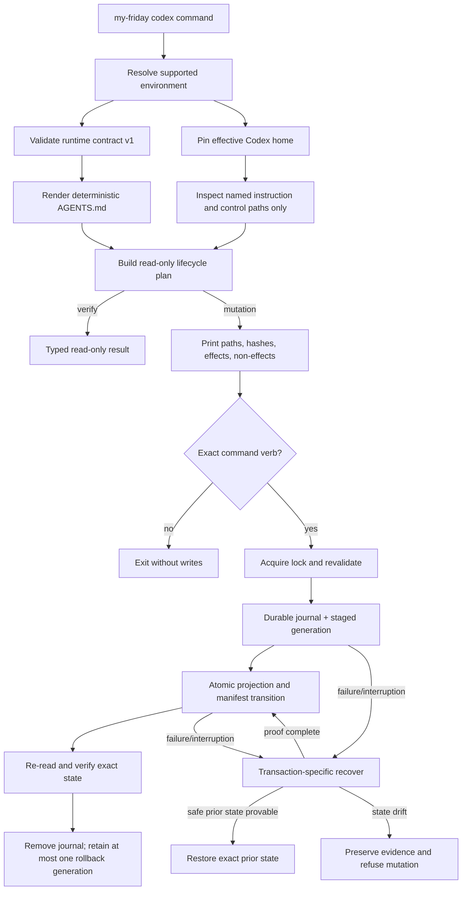

# Technical Design

## Component And Behavior Flow

The plan is immutable between preview and execution: it includes canonical
runtime and Codex-home paths, source contract and assistant identifiers, target
device/inode identity, current state digests, desired projection digest,
operation kind, plan ID, and exact action/non-action lists. Immediately after
locking, execution recomputes all safety-relevant facts and rejects any change.

All commands are synchronous. There is no daemon, scheduled job, file watcher,
login item, or background repair.

## State And Data Model

### Named paths

For effective Codex home `C`, My Friday may address only:

- `C/AGENTS.override.md` — metadata/non-empty check only; never read into a
  plan, copied, changed, or removed;
- `C/AGENTS.md` — the sole managed projection;
- `C/.my-friday/` — a private owner-only control namespace created only when
  absent and wholly owned by this capability;
- `C/.my-friday/install.json` — active installation manifest;
- `C/.my-friday/generations/active/AGENTS.md` — exact active generation;
- `C/.my-friday/generations/previous/AGENTS.md` and manifest — optional single
  rollback generation;
- `C/.my-friday/transactions/<plan-id>.json` and stage files — one active
  journal, removed only after final verification.

A pre-existing `.my-friday` path without a valid compatible control manifest
is a foreign collision. The implementation does not adopt it or enumerate it.

### Installation manifest v1

The JSON manifest is schema-validated, owner-only, and includes:

- contract version and tool contract version;
- assistant ID;
- canonical runtime source path and runtime-manifest digest;
- canonical Codex-home path and device identity;
- projection relative path, digest, byte length, and mode;
- renderer contract version and generation ID;
- source profile digest, creation/update timestamp, and My Friday version;
- optional previous generation ID/digest; and
- status `active` only after exact projection verification.

It contains no profile prose, unrelated directory listing, Codex config,
credential, authentication state, session/log content, or secret.

### Transaction journal v1

The journal records the operation, plan ID, phase, pinned path and filesystem
identity, before/desired manifest and projection digests, stage paths, exact
owned paths, and whether the tool created the control directory. It stores
complete prior bytes only for the manifest-owned projection and control files,
never for unrelated Codex state.

Phases are `journaled`, `staged`, `projection-promoted`, `manifest-promoted`,
`verified`, and `cleaned`. A generation becomes active only when projection
and manifest agree. Recovery completes a partially published desired state
when staged/target proofs match; otherwise it restores the exact manifest-owned
prior generation. If neither is provable, it preserves the journal and refuses.

### Lifecycle invariants

1. No write occurs outside the two owned path families.
2. An absent install has neither projection nor control namespace after clean
   uninstall or rolled-back first install.
3. Active projection bytes, active generation bytes, and manifest digest agree.
4. At most one previous verified generation exists.
5. Foreign or drifted bytes are never deleted automatically.
6. Journals and manifests are durable before the transition they authorize.
7. Repeating a completed command is read-only and reports already installed,
   healthy, already repaired/upgraded, already rolled back, or not installed.
8. Before replacement or deletion, every path is opened relative to the pinned
   Codex-home descriptor with no-follow semantics; managed files must be regular,
   single-link, current-UID-owned, expected-mode entries, and the complete
   control tree must match the allowlisted manifest/journal layout. Revalidate
   device, inode, link count, owner, mode, type, digest, and directory entries
   immediately before mutation.

## Interfaces And Contracts

### `my-friday codex install --runtime PATH`

Requires no installation manifest, absent `AGENTS.md`, absent non-empty
`AGENTS.override.md`, and absent `.my-friday`. Validates runtime contract v1,
renders generation 1, previews all effects, and requires exact `Install`.
Success prints installation and verification IDs. Existing exact state is
reported only through a valid manifest, never inferred from equal foreign bytes.

### `my-friday codex verify`

Read-only and requires no confirmation. It reports a stable status and exit
code for `installed-healthy`, `not-installed`, `interrupted`, `shadowed`, `collision`,
`projection-drift`, `source-drift`, `source-missing`, `contract-incompatible`,
or `environment-unsupported`. Installed integrity is separate from source
freshness: `installed-healthy` means manifest, stored active generation,
projection, renderer contract, and pinned home agree with no shadowing override;
`source-current`, `source-drift`, or `source-missing` is reported independently.

### `my-friday codex repair`

Uses the manifest's runtime source. It is permitted only when the control
manifest proves ownership and the failure is repairable. It may restore a
drifted/missing projection from the exact verified active generation or rebuild
derived metadata from agreeing manifest/generation proofs,
but never a foreign control namespace, incompatible manifest, changed root, or
shadowing override. Preview names old and desired digests and requires `Repair`.
Repair never rotates the previous slot and never promotes drifted target bytes
into history. If the active generation is invalid, repair requires a matching
manifest and journal-proven desired stage; otherwise it retains evidence and
refuses. Source drift is handled by `upgrade`.

### `my-friday codex upgrade --runtime PATH`

Validates a compatible runtime source and assistant ID, renders a changed
generation, retains the old verified generation, previews the change, and
requires `Upgrade`. Identical desired bytes are an idempotent no-op. Changing
assistant identity is uninstall/install, not upgrade.

### `my-friday codex rollback`

Requires exact installed-state integrity and one valid previous stored
generation; the runtime source need not exist or be current.
Previews both generation IDs/digests and requires `Rollback`. It swaps previous
into active transactionally and consumes the rollback slot so repeating the
command reports no rollback available.

### `my-friday codex uninstall`

Requires exact projection/control proofs with no active transaction and does
not read or require the runtime source. It previews every removed owned path
and requires `Uninstall`.
It removes projection first only after durable deletion authorization, then
removes generation/control state and the empty tool-owned directory. On drift
it refuses; it does not preserve or delete unknown bytes under its namespace.

### `my-friday codex recover --transaction PATH`

Accepts only a canonical journal beneath the pinned control transaction
directory whose IDs and derived paths validate. It is idempotent and
non-interactive after printing the intended recovery. It never accepts an
arbitrary deletion target. Existing repository-bootstrap `recover` remains
unchanged and unambiguous because installed recovery is namespaced under
`codex`.

### Environment boundary

Production resolution uses `CODEX_HOME` when set and otherwise the current
non-root user's home plus `.codex`, matching official behavior. The directory
must already exist, be a real directory with no symlink component, be owned by
the current UID, reside under that user's canonical home, and be on local APFS.
My Friday opens and pins it before preview; a changed device/inode fails before
write. The runtime source is canonical, non-symlink, contract-v1, and distinct
from the Codex home/control paths.

Tests do not call this production resolver. Domain and transaction constructors
require explicit `UserHome`, `CodexHome`, filesystem capability, clock, and
fault hook. CLI integration tests set a temporary environment only around a
subprocess and assert the printed root is the temporary root before confirming.

## Authorization And Data Exposure

| Subject | Action/resource | Condition | Denial and evidence |
|---|---|---|---|
| Current non-root user | Read runtime contract/profile | Canonical runtime v1 owned/readable by user | Typed source error; no Codex-home write |
| My Friday process | Inspect named Codex-home paths | Pinned owner-controlled supported root | Unsupported environment/path denial |
| My Friday process | Create projection/control state | Exact absent or manifest-owned state and exclusive lock | Collision/drift/race denial with path and digest, not file content |
| My Friday process | Replace managed projection | Manifest ownership, matching before digest, explicit verb | Journal retained on uncertain failure |
| My Friday process | Remove managed paths | Exact manifest, digest, generation, and derived paths | Refuse foreign/changed content; never broaden deletion |
| Independent acceptor | Run discovery smoke | Disposable identity and sanitized test profile/account | No use of developer/Alfred credentials or live home |

No command requires admin, `sudo`, keychain access, network, or credentials.
Evidence may record canonical temporary/disposable paths in a sanitized form,
digests, versions, modes, device type, phase, and outcome. It must not publish
real home paths, profile prose, tokens, auth state, unrelated filenames, or
live Codex configuration.

## Failure, Recovery, And Observability

- Stable error classes cover input, unsupported environment, source contract,
  collision, drift, shadowing, concurrent operation, transaction rollback,
  recovery required, and verification failure.
- Each mutation prints plan ID, operation, canonical source and target, current
  and desired digests, managed actions, prohibited effects, confirmation verb,
  phase progress, and final receipt. It prints no unrelated contents.
- Lock acquisition is non-blocking. A second process reports the active plan or
  stale journal; it never steals a lock without proving process-independent
  journal recovery.
- Fault hooks bracket every durable phase in tests. A handled failure restores
  the exact prior managed state or reports recovery required; it never reports
  success with projection/manifest disagreement.
- Recovery revalidates root identity, journal schema, derivation, ownership,
  stages, target digests, and current source-independent desired bytes before
  mutation. Source disappearance does not prevent completing a fully staged,
  journal-proven generation.
- Verification is the operator diagnostic. There is no telemetry or automatic
  reporting.

## Design Traceability

| Acceptance/critical journey | Component and state | Interface | Authority/recovery |
|---|---|---|---|
| Manifest ownership per projection | Manifest v1, active generation, digest invariant | install/verify | Exact manifest and named path only |
| Pre-change preview | Immutable lifecycle plan | every mutation command | Exact confirmation then lock/revalidate |
| Collision safety | Named-path inspection and foreign-state classification | install/verify | Fail closed; no merge/adoption |
| Interrupted recovery | Journal v1 and staged/previous generations | recover | Complete or restore only from exact proofs |
| Complete reversal | Absent-state invariant and uninstall transaction | uninstall/verify | Remove exact owned state; drift blocks |
| Repair | Desired renderer plus owned prior state | repair | Explicit replacement; rollback/recovery proof |
| Rollback | Single previous generation | rollback | One-step consumed slot; idempotent retry |
| No daemon/background service | Synchronous CLI flow | all | No scheduled or persistent process |
| Existing install protected during development | Injected test roots and disposable acceptance identity | test/acceptance harness | Live Alfred/developer homes prohibited |
