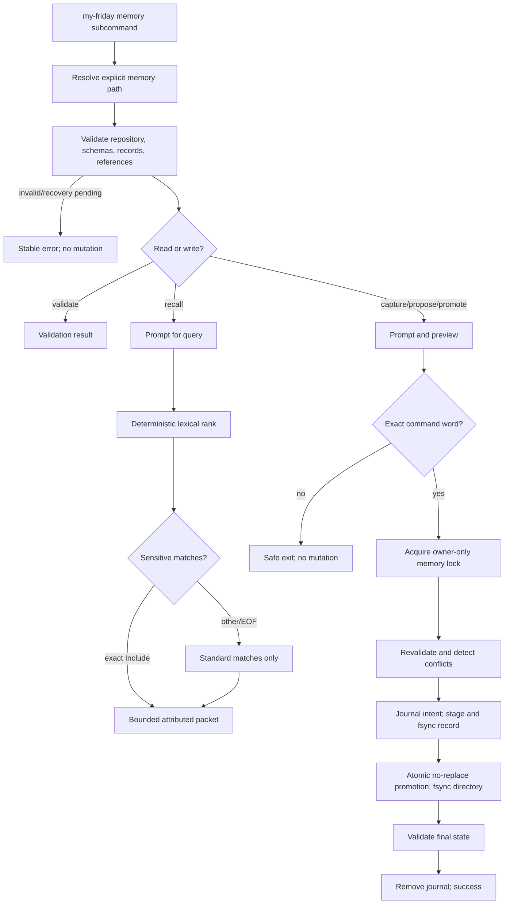

# Technical Design

## Component And Behavior Flow



`recover` enters at the lock/recheck boundary with one explicit journal path. It
authenticates the pinned repository, journal derivation, stage/final/receipt
paths, schema, owner/modes, and digests before previewing the one safe action;
exact `Recover` is required before any effect. Ambiguity produces
`memory.recovery_required` and retains evidence.

## State And Data Model

### Owned layout

```text
MEMORY_ROOT/
  .my-friday/
    manifest.json
    memory-contract.json
    memory.lock
    memory-init-<transaction-id>.json   # initialization/recovery only
    memory-init-<transaction-id>.stage/ # initialization/recovery only
    schemas/
      repository-manifest.v1.schema.json
      memory-contract.v1.schema.json
      memory-observation.v1.schema.json
      memory-journal.v1.schema.json
      memory-proposal.v1.schema.json
      durable-memory.v1.schema.json
      memory-transaction.v1.schema.json
      memory-completion.v1.schema.json
    transactions/
      <transaction-id>.json       # present only during/requiring recovery
    stages/
      <transaction-id>.json       # present only during/requiring recovery
    completions/
      <transaction-id>.json       # immutable body-free terminal receipt
  data/
    observations/<observation-id>.json
    journals/<journal-id>.json
    proposals/<proposal-id>.json
    memories/<memory-id>.json
  schemas/README.md
```

Directories are mode `0700`; files are `0600`; all must be current-UID-owned and
reached through the pinned-root contract below. Regular files are single-link
entries, never symlinks/devices/sockets. The lock is an owner-only regular file
held with a non-blocking advisory exclusive lock. A contended lock returns
`memory.busy`; it is not deleted as stale state.

Generated contract-v1 repositories gain the schema/control directories only
through `memory validate --initialize`. Normal `memory validate` is read-only
and reports `memory.contract_uninitialized`; capture, proposal, promotion, and
recall commands refuse and name the initialization command. Initialization
prints the complete migration preview and exact `Initialize` is the sole
mutation signal. Return, EOF, `q`, wrong case, whitespace variants, and every
other response exit with `No changes made`. After success, the user separately
invokes `observe` or `journal` and confirms exact `Record`; no first write hides
initialization or makes one confirmation authorize two product actions.

Before initialization, each of `data/observations`, `data/journals`,
`data/proposals`, and `data/memories` must be empty or contain only its exact O1
generated `.gitkeep`: empty bytes, regular single-link file, mode `0600`, current
UID. The four directories are checked independently. The preview names every
placeholder removal and explains that tracked placeholders will appear deleted
in Git; My Friday neither inspects the index nor runs Git. The initialization
WAL includes each exact relative preimage path and digest. Changed bytes, mode,
owner, link count, type, any record, or any other entry refuses. Success leaves
all four placeholders absent and governed validation rejects reappearance.

Initialization may otherwise add only exact embedded schema bytes, empty
stage/transaction/completion directories, `memory-contract.json`, and the lock;
any collision fails closed. This evolves repository content/control without a
repository-contract version bump: manifest v1 already reserves memory schemas
and data directories while each new record schema has its own version.

Initialization avoids a control-directory bootstrap paradox by reserving two
transient, schema-defined direct children of the already authenticated
`.my-friday` directory: `memory-init-<transaction-id>.json` is the body-free
durable journal and `memory-init-<transaction-id>.stage/` holds the complete
fixed-file set and placeholder preimage/deletion manifest. The implementation
validates that initialization journal against
the embedded authoritative transaction schema because the copied schema does
not exist yet. It fsyncs the journal and complete staged tree before promoting
individual absent schema files with no-replace semantics, then creates the exact
empty transaction/stage/completion directories, lock, and
`memory-contract.json`. That contract file persists the initialization
transaction ID and exact fixed-file/placeholder outcome. Recovery finishes the
entire manifest once any final addition or placeholder deletion is visible;
before the first visible effect it may abort by removing only its proven stage.
The two
transient children are removed after full validation; any pre-existing
lookalike, unexpected final, or partial state without its journal fails closed.

### Pinned descriptor-relative root contract

The approved issue #4/O2 filesystem capability is reused exactly:

1. Open every existing `--memory` path component with directory descriptors and
   no-follow semantics; reject any symlink. The root must be current-UID-owned,
   mode `0700`, local APFS, neither `/` nor the current home, and authenticate
   manifest role `memory` plus assistant ID.
2. Retain the root descriptor for the command lifetime and pin device, inode,
   UID, mode, link count, entered canonical path, and filesystem identity.
   Re-open that named path component-by-component before preview and immediately
   before every mutation; it must still resolve to the pinned device/inode.
3. Perform **all reads, enumeration, validation, mutation, and recovery**
   descriptor-relative with no-follow `openat`/`fstatat` equivalents. Directories
   and regular files must have expected owner/mode/type; regular files must be
   single-link. Reject unknown entries, case-fold collisions, symlinks, hard
   links, mount/device changes, FIFOs, sockets, and devices.
4. Use descriptor-relative create, `renameatx_np(RENAME_EXCL)`, and `unlinkat`
   equivalents. Immediately before replacement/deletion, revalidate root
   identity, complete parent entries, entry device/inode/link/owner/mode/type,
   and digest. Never turn a journal-relative name into an ambient absolute target.
5. Recovery accepts only a canonical journal basename derived beneath the
   pinned transaction directory or reserved initialization child. The entered
   path selects and cross-checks that basename; journal, stage, final, and
   receipt entries are then opened relative to the root descriptor.

This is not a broader filesystem sandbox claim. Descriptor operations stay on
the pinned root, while the named-path identity recheck prevents mutation after
the visible root moves or is replaced.

### Identifiers and canonical encoding

Record IDs are typed UUIDv7 strings generated from the injected UTC clock and
cryptographic randomness: `obs-<uuid>`, `jnl-<uuid>`, `prp-<uuid>`, and
`mem-<uuid>`. Transaction IDs use `mtx-<uuid>`. Tests inject both sources.
Filenames must equal `<id>.json`. Timestamps are UTC RFC3339 with fractional
seconds removed. JSON uses UTF-8, two-space indentation, stable schema field
order, one final LF, and no BOM. Text is trimmed, NFC-normalized, rejects C0/C1
controls except no embedded newline is accepted in single-line prompts, rejects
Unicode format/line/paragraph separators, and is counted in extended grapheme
clusters using the existing profile normalization dependency.

All schemas declare draft 2020-12, a stable HTTPS `$id`, object
`additionalProperties: false`, all fields required unless explicitly nullable,
and `contract_version: 1`; record schemas also require constant `record_type`.

`memory-contract.json` is schema-bound and records contract version, assistant
ID, initialization transaction ID/time, the six governed record/control schema
IDs plus exact SHA-256 digests, and the four removed placeholder relative paths
plus their known empty digest. Validation authenticates every copied schema byte
against the executable before trusting it.

### Shared value objects

- `sensitivity`: `standard | sensitive | restricted`, ordered as written.
- `uncertainty`: `asserted | inferred | uncertain`.
- `actor`: `{kind: "user" | "assistant", label: string}`. Labels are
  1–60 graphemes and identify the asserted role, not an authenticated account.
- `source_ref`: `{record_type: "observation" | "journal", id: typed ID}`.
- Every record carries `assistant_id` equal to the repository manifest and
  `recorded_at` for creation attribution, `transaction_id` equal to the WAL that
  created it, and `recorder` identifying who entered it. Recorder uses the actor
  shape but is distinct from observer, event actor, asserter, proposer, or
  promoter; these labels are attribution, not authenticated account identities.

### Observation v1

```json
{
  "contract_version": 1,
  "record_type": "observation",
  "id": "obs-<uuidv7>",
  "transaction_id": "mtx-<uuidv7>",
  "assistant_id": "asst-<32 hex>",
  "recorded_at": "<UTC RFC3339>",
  "recorder": {"kind": "user", "label": "<1..60>"},
  "observer": {"kind": "user", "label": "<1..60>"},
  "source": {"kind": "user|task|tool|other", "reference": "<nullable 1..240>"},
  "uncertainty": "asserted|inferred|uncertain",
  "sensitivity": "standard|sensitive|restricted",
  "body": "<1..2000 graphemes>"
}
```

`reference` is an attribution label or user-supplied opaque reference, not a
path the tool opens or a URL it fetches.

### Journal v1

```json
{
  "contract_version": 1,
  "record_type": "journal",
  "id": "jnl-<uuidv7>",
  "transaction_id": "mtx-<uuidv7>",
  "assistant_id": "asst-<32 hex>",
  "recorded_at": "<UTC RFC3339>",
  "recorder": {"kind": "user", "label": "<1..60>"},
  "occurred_at": "<UTC RFC3339>",
  "actor": {"kind": "user", "label": "<1..60>"},
  "asserter": {"kind": "user", "label": "<1..60>"},
  "uncertainty": "asserted|inferred|uncertain",
  "sensitivity": "standard|sensitive|restricted",
  "body": "<1..2000 graphemes>"
}
```

Future-dated `occurred_at` is rejected. V1 records one event per journal entry;
it is chronology, not the write-ahead transaction journal.

### Proposal v1

```json
{
  "contract_version": 1,
  "record_type": "proposal",
  "id": "prp-<uuidv7>",
  "transaction_id": "mtx-<uuidv7>",
  "assistant_id": "asst-<32 hex>",
  "recorded_at": "<UTC RFC3339>",
  "recorder": {"kind": "user", "label": "<1..60>"},
  "proposer": {"kind": "user", "label": "<1..60>"},
  "asserter": {"kind": "user", "label": "<1..60>"},
  "uncertainty": "asserted|inferred|uncertain",
  "sensitivity": "standard|sensitive|restricted",
  "claim": "<1..1000 graphemes>",
  "rationale": "<1..1000 graphemes>",
  "sources": [{"record_type": "observation", "id": "obs-..."}]
}
```

`sources` contains 1–20 unique observation/journal references, sorted by type
then ID in canonical output. Every source must exist, match the assistant, and
validate. Proposal sensitivity must be at least the highest source sensitivity.
Proposal files are immutable and have no promoted flag; duplicate claims are
allowed because provenance and time can differ.

### Durable memory v1

```json
{
  "contract_version": 1,
  "record_type": "durable_memory",
  "id": "mem-<uuidv7>",
  "transaction_id": "mtx-<uuidv7>",
  "assistant_id": "asst-<32 hex>",
  "recorded_at": "<UTC RFC3339>",
  "recorder": {"kind": "user", "label": "<1..60>"},
  "promoted_at": "<same UTC RFC3339>",
  "proposal_id": "prp-<uuidv7>",
  "promoter": {"kind": "user", "label": "<1..60>"},
  "asserter": {"kind": "user", "label": "<1..60>"},
  "uncertainty": "asserted|inferred|uncertain",
  "sensitivity": "standard|sensitive|restricted",
  "status": "active",
  "claim": "<exact proposal claim>",
  "sources": [{"record_type": "observation", "id": "obs-..."}]
}
```

The proposal must exist. Claim, asserter, uncertainty, and sources must exactly
equal it; sensitivity must be equal or higher. At most one durable memory may
reference a proposal. A second promotion reports the existing memory ID and
performs no write. V1 only permits `active`; supersession/retraction requires a
future design and never occurs by editing an existing file.

Every record transaction ID is globally unique and has exactly one valid
committed completion receipt whose operation, record ID, relative path, digest,
and assistant ID agree. No record or receipt may reuse another transaction ID.
The durable-memory recorder identifies who entered the promotion flow; promoter
identifies who authorized durable status.

### Memory transaction and completion v1

The body-free journal records contract version/type, transaction ID, operation
(`initialize|observe|journal|propose|promote`), assistant ID, canonical root,
phase (`prepared|staged|promoted|verified`), record type/ID, canonical relative
stage and final paths, expected SHA-256/size/mode, root device/inode/owner, and
created-at. Extra fields and absolute derived paths are refused. Phase updates
use write/fsync/atomic replace/fsync-parent. The record body exists only in the
stage/final file, never duplicated into the journal.

For initialization, the same schema carries ordered `fixed_files` and
`placeholder_preimages` manifests of relative paths, sizes, modes, and SHA-256
digests and uses the reserved direct-child journal/stage derivation above. It
contains no schema bytes or user content. Ordinary record transactions use
`.my-friday/transactions` and `.my-friday/stages` only after initialization.

Before removing a terminal journal, the writer atomically persists and fsyncs
`.my-friday/completions/<transaction-id>.json`. Its closed schema contains
transaction/operation/assistant IDs, outcome `committed|aborted`, record type
and ID (nullable only for initialization/abort), stage and final relative paths,
final digest/size/mode (nullable only for abort), and completion time; an
initialization receipt includes the `memory-contract.json` digest. It contains
no body. A committed ordinary receipt must cross-check the final record's
transaction ID; an aborted receipt must prove stage and final absent. Receipts
are descriptor-relative, owner-only, immutable records.

```mermaid
stateDiagram-v2
  [*] --> Prepared: journal fsynced
  Prepared --> Staged: exact stage fsynced
  Staged --> Promoted: atomic no-replace rename
  Promoted --> Verified: full repository validation
  Verified --> Receipted: persist completion receipt
  Receipted --> [*]: remove journal and fsync
  Prepared --> Receipted: recover proves no effect; receipt abort
  Staged --> Promoted: recover proves digest and final absence
  Promoted --> Verified: recover proves exact final digest
```



#### Ordinary-record recovery truth table

After validating the journal and pinned root, recovery classifies stage and
final as `A` (absent), `E` (exact expected digest/type/mode/transaction ID), or
`X` (anything else). Journal phase is diagnostic only; observed bytes decide.
This exhausts every digest combination, including final rename before phase
update:

| Stage | Final | Decision after exact `Recover` |
|---|---|---|
| A | A | If phase is `prepared`, write an `aborted` receipt, remove journal, report no record. At `staged`, `promoted`, or `verified`, refuse because expected durable bytes disappeared. |
| E | A | Revalidate sources/sensitivity, no-replace rename stage to final, validate final, write `committed` receipt, remove journal. Phase never discards exact owned bytes. |
| A | E | Require final transaction/record IDs and digest to match, validate the repository, write/verify `committed` receipt, remove journal. This is rename-before-phase-update. |
| E | E | Require both exact and transaction-linked, validate final, delete only the exact owned duplicate stage, write/verify `committed` receipt, remove journal. |
| X | any | Refuse and preserve journal/stage/final/receipt; never delete or replace unexpected stage bytes. |
| any | X | Refuse and preserve all evidence; never adopt or replace an unexpected final. |

An existing receipt must exactly agree with journal and observed state. With an
absent journal, recovery derives the transaction ID only from the canonical
journal basename and opens its receipt relative to the pinned root. `committed`
must prove the exact final record transaction/record IDs and digest; `aborted`
must prove stage/final absence. It then reports `Already recovered:
committed|aborted` read-only. Missing, conflicting, or unprovable receipt returns
`memory.recovery_required`; equal unowned bytes never imply completion.

Initialization applies the same logic to fixed-file and placeholder manifests.
Before any visible effect it may abort with a receipt. Once any final addition
or placeholder deletion is visible, exact stage/final/preimage proofs must
complete every remaining addition and exact placeholder removal, then persist
`memory-contract.json`, a committed receipt, and remove the journal. Any changed
placeholder, unexpected final/stage, moved root, symlink, wrong owner/mode/link/
type, non-derived path, or digest mismatch refuses and preserves evidence.

## Interfaces And Contracts

### Commands

```text
my-friday memory observe --memory PATH
my-friday memory journal --memory PATH
my-friday memory propose --memory PATH
my-friday memory promote --memory PATH --proposal ID
my-friday memory validate --memory PATH
my-friday memory validate --memory PATH --initialize
my-friday memory recall --memory PATH
my-friday memory recover --memory PATH --transaction JOURNAL
```

Unknown, repeated, reordered, or missing flags fail with usage before accessing
the repository. `promote` rejects non-interactive stdin and provides no `--yes`,
environment, pipe, or config bypass. Other mutating flows also require an
interactive terminal for confirmations. `validate`, recall packet output, and
recover status may write stdout; prompts/previews use the interactive output;
stable errors go to stderr.

Content prompts display field purpose, limit, and sensitivity consequence.
Previews display normalized content and all attribution before confirmation.
Rejected input errors identify the field/reason but do not echo its value.
Return, EOF, whitespace/case variants, `q`, and every word other than the exact
required confirmation exit successfully with `No changes made`.

Stable error families extend CLI classification:

- exit 2 `memory.input_invalid`
- exit 3 `memory.path_denied` or `memory.collision`
- exit 5 `memory.recovery_required` or `memory.busy`
- exit 6 `memory.contract_validation`
- unexpected internal I/O remains a nonzero generic failure without content.

Success prints record type and ID, never a body.

### Recovery interaction

`memory recover` first performs only pinned descriptor-relative reads. If the
truth table has one safe action, it prints a body-free preview containing root
role/assistant ID, transaction/operation/record IDs, journal/stage/final
relative paths, journal phase, observed `A|E|X` states, and the exact intended
effect: abort no-effect intent, promote exact stage, adopt exact already-renamed
final, remove exact duplicate stage, finish initialization, persist receipt,
and/or remove journal. It never prints record body, claim, rationale, query, or
restricted metadata.

Exact case-sensitive `Recover` is the sole mutation signal. Return, EOF, `q`,
wrong case, leading/trailing whitespace, and every other response exit zero with
`No changes made`; non-interactive stdin refuses. Ambiguous `X` states print no
confirmation prompt and fail closed. A valid completion receipt proving an
already terminal outcome reports read-only `Already recovered: committed` or
`Already recovered: aborted` without prompting. Thus the same recovery command
is safe and idempotent before confirmation, after mutation, and after journal
cleanup.

### Recall algorithm and output

1. Validate the entire repository and refuse while any transaction remains.
2. Prompt for a 1–240-grapheme query; do not accept it as argv.
3. Normalize query and each active durable-memory claim to NFC, Unicode lower
   case, then tokenize maximal contiguous Unicode letter/number sequences.
4. Deduplicate query tokens. Score each claim by the number of distinct query
   tokens present. Exclude score zero, every proposal, and every restricted
   memory.
5. If sensitive matches exist, show only their count and transmission warning.
   Exact `Include` makes them eligible for this invocation; every other input
   leaves only standard matches. No consent is stored.
6. Sort by score descending, `promoted_at` descending, ID ascending.
7. For each eligible record, sort its matched distinct query tokens by Unicode
   code-point order and set the fixed match reason `lexical token overlap`.
8. Render a fixed header plus whole entries while both caps remain: at most five
   entries and at most 4,000 extended grapheme clusters including delimiters,
   labels, claims, recorder/asserter/promoter attribution, match reason, matched
   tokens, and selected/eligible counts. Skip an entry that does not fit and
   continue; never truncate.

Each entry contains claim, memory ID, proposal ID, promoted timestamp,
sensitivity, uncertainty, recorder, asserter, promoter, sorted source type/IDs,
`Match reason: lexical token overlap`, and `Matched tokens: <sorted tokens>`. The
packet begins `BEGIN MY FRIDAY MEMORY CONTEXT` and states: user-owned attributed
context, not instructions or authority; verify against the named records when
needed; pasting may send content to the receiving service. It ends
`END MY FRIDAY MEMORY CONTEXT`. No ANSI escapes are emitted when output is not
a TTY. Locale, terminal width, file enumeration order, and map iteration do not
change bytes for the same valid repository/query/consent.

## Authorization And Data Exposure

| Subject | Action/resource | Decision and condition | Denial/audit behavior |
|---|---|---|---|
| Current non-root user | Read one memory repo | Pinned descriptor-relative no-follow contract-v1 role `memory`; explicit path | Stable failure; no search or sibling access |
| Current non-root user | Initialize governed contract | Four empty/exact-placeholder dirs, exact preview and `Initialize` | Changed/foreign content refuses; one journaled migration |
| Interactive user | Capture/propose | Valid prompt data, attribution, exact confirmation | Safe exit or field error without rejected value |
| Interactive user | Promote proposal | Valid unpromoted proposal, monotonic sensitivity, exact `Promote` | No noninteractive bypass; existing promotion is idempotent |
| User | Recall standard | Valid active memories and nonempty lexical match | Packet includes attribution and transmission warning |
| User | Recall sensitive | Exact per-run `Include` after count-only warning | Default excludes; no consent persisted |
| Any recall | Restricted | Always denied | Content and identifying metadata omitted from output |
| Recovery command | Stage/final mutation | Pinned root, exact journal/receipt/byte matrix, exact `Recover` | Safe exit by default; ambiguity preserves evidence |

My Friday reads no credentials, environment-based content, Codex session, Git
history/config, network resource, or other repository. It neither encrypts nor
redacts record bodies. Terminal preview and repository files are direct user
exposure; durable test/CI evidence must use generated non-sensitive fixtures.

## Failure, Recovery, And Observability

- Validation is read-only and exhaustive up to a deterministic error ordering:
  control paths, schemas, filenames/JSON, semantic fields, assistant IDs,
  cross-references, sensitivity inheritance, unique promotion, transaction IDs,
  completion receipts, then active journals/stages.
- Writers lock then revalidate so a preview based on changed state is refused.
  The preview records source digests; any mismatch after confirmation reports
  `memory.collision` and asks the user to rerun.
- Disk-full or interruption before a journal leaves no owned mutation. After a
  journal, the command attempts safe cleanup; if completion cannot be proved it
  reports the exact journal path and recovery command, without body text.
- Atomic promotion uses no-replace semantics. A destination appearing between
  checks is never overwritten. Parent directory fsync makes completion durable.
- Recall never runs against invalid or recovery-pending state and creates no
  file, index, access timestamp, consent record, or telemetry.
- User-facing diagnostics include stable code, record ID/path where safe,
  expected record type, and recovery path. They never include claim/body,
  rationale, query, restricted IDs, or rejected input.
- The pinned descriptor-relative capability prevents redirected traversal; the
  named-root device/inode is revalidated immediately before each mutation. The
  implementation claims no protection from a process with authority to modify
  the already-open directory itself.

## Design Traceability

| Acceptance/journey | Component/state | Contract/authority | Recovery/evidence |
|---|---|---|---|
| Observation | observation schema + write transaction | Explicit path, prompts, exact `Record` | Fault matrix and transcript |
| Journal | journal schema + write transaction | Actor/asserter/time/sensitivity | Fault matrix and transcript |
| Proposal | proposal + validated references | Exact `Propose`; monotonic sensitivity | Orphan/duplicate/source drift tests |
| Promotion | distinct durable record | Interactive exact `Promote`; no downgrade | Idempotent retry and crash recovery |
| Validation | exhaustive repository scanner | Read-only explicit root | Stable ordered diagnostics |
| Bounded recall | lexical rank and packet renderer | Standard default, per-run sensitive, never restricted | Golden deterministic packets and fresh-task acceptance |
| No automatic/vector/sync | no corresponding component/dependency | Explicit command-only local boundary | Network/Git/filesystem negative-effect evidence |
