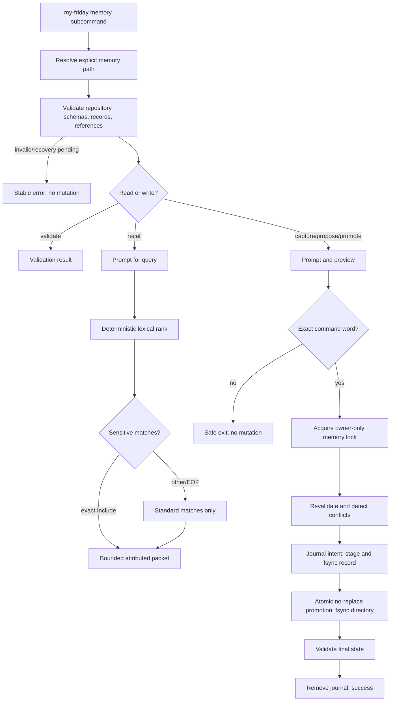
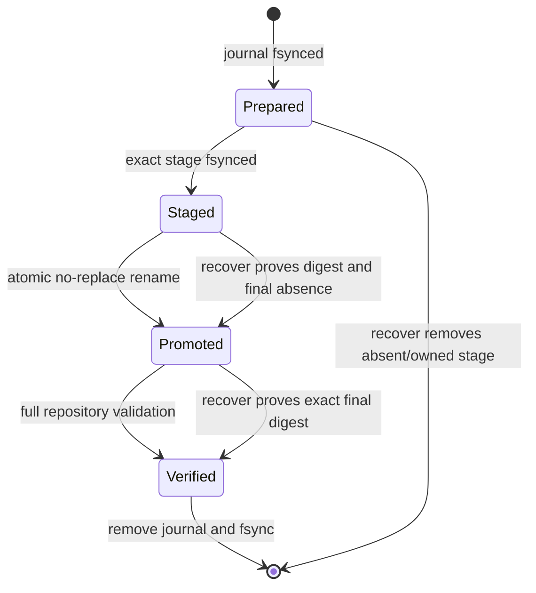

# Technical Design

## Component And Behavior Flow



`recover` enters at the lock/recheck boundary with one explicit journal path. It
authenticates the canonical repository, journal derivation, stage/final paths,
schema, owner/modes, and digests before completing promotion or removing an
owned stage. Ambiguity produces `memory.recovery_required` and retains evidence.

## State And Data Model

### Owned layout

```text
MEMORY_ROOT/
  .my-friday/
    manifest.json
    memory.lock
    memory-init-<transaction-id>.json   # initialization/recovery only
    memory-init-<transaction-id>.stage/ # initialization/recovery only
    schemas/
      repository-manifest.v1.schema.json
      memory-observation.v1.schema.json
      memory-journal.v1.schema.json
      memory-proposal.v1.schema.json
      durable-memory.v1.schema.json
      memory-transaction.v1.schema.json
    transactions/
      <transaction-id>.json       # present only during/requiring recovery
    stages/
      <transaction-id>.json       # present only during/requiring recovery
  data/
    observations/<observation-id>.json
    journals/<journal-id>.json
    proposals/<proposal-id>.json
    memories/<memory-id>.json
  schemas/README.md
```

Directories are mode `0700`; files are `0600`; all must be owned by the current
user, regular (not symlink/device/socket), and beneath a canonical non-symlink
contract-v1 memory root on the supported local filesystem. The lock is an
owner-only regular file held with a non-blocking advisory exclusive lock. A
contended lock returns `memory.busy`; it is not deleted as stale state.

Generated older contract-v1 repositories gain the schema/control directories
through an explicit first memory write or `memory validate --initialize`
preview requiring exact `Initialize`. Normal `memory validate` is read-only and
reports `memory.contract_uninitialized` when governed-memory schemas are absent.
For a first `observe` or `journal`, the normal complete preview names both the
fixed governed-contract initialization and the requested record; exact `Record`
authorizes that one journaled composite operation, so the happy path gains no
extra confirmation. `propose`, `promote`, and `recall` require initialized
state. Standalone `--initialize` exists for inspection or provisioning and uses
exact `Initialize`.
Initialization may add only the exact embedded schema bytes, empty stages and
transactions directories, and lock file; any collision or foreign entry fails
closed. This is repository content/control evolution, not a repository-contract
version bump: manifest contract v1 already reserves memory schemas and record
directories, while each new record schema carries its own version.

Initialization avoids a control-directory bootstrap paradox by reserving two
transient, schema-defined direct children of the already authenticated
`.my-friday` directory: `memory-init-<transaction-id>.json` is the body-free
durable journal and `memory-init-<transaction-id>.stage/` holds the complete
fixed-file set. The implementation validates that initialization journal against
the embedded authoritative transaction schema because the copied schema does
not exist yet. It fsyncs the journal and complete staged tree before promoting
individual absent schema files with no-replace semantics, then creates the exact
empty transaction/stage directories and lock. Recovery finishes the manifest
or removes only the proven stage when no final file has been promoted. The two
transient children are removed after full validation; any pre-existing
lookalike, unexpected final, or partial state without its journal fails closed.

### Identifiers and canonical encoding

Record IDs are typed UUIDv7 strings generated from the injected UTC clock and
cryptographic randomness: `obs-<uuid>`, `jnl-<uuid>`, `prp-<uuid>`, and
`mem-<uuid>`. Transaction IDs use `mtx-<uuid>`. Tests inject both sources.
Filenames must equal `<id>.json`. Timestamps are UTC RFC3339 with fractional
seconds removed. JSON uses UTF-8, two-space indentation, stable schema field
order, one final LF, and no BOM. Text is trimmed, NFC-normalized, rejects C0/C1
controls except no embedded newline is accepted in single-line prompts, rejects
Unicode format/line/paragraph separators, and is counted in extended grapheme
clusters using the existing profile normalization dependency.

All schemas declare draft 2020-12, a stable HTTPS `$id`, object
`additionalProperties: false`, all fields required unless explicitly nullable,
and `contract_version: 1` plus a constant `record_type`.

### Shared value objects

- `sensitivity`: `standard | sensitive | restricted`, ordered as written.
- `uncertainty`: `asserted | inferred | uncertain`.
- `actor`: `{kind: "user" | "assistant", label: string}`. Labels are
  1–60 graphemes and identify the asserted role, not an authenticated account.
- `source_ref`: `{record_type: "observation" | "journal", id: typed ID}`.
- Every record carries `assistant_id` equal to the repository manifest and
  `recorded_at` for creation attribution.

### Observation v1

```json
{
  "contract_version": 1,
  "record_type": "observation",
  "id": "obs-<uuidv7>",
  "assistant_id": "asst-<32 hex>",
  "recorded_at": "<UTC RFC3339>",
  "observer": {"kind": "user", "label": "<1..60>"},
  "source": {"kind": "user|task|tool|other", "reference": "<nullable 1..240>"},
  "uncertainty": "asserted|inferred|uncertain",
  "sensitivity": "standard|sensitive|restricted",
  "body": "<1..2000 graphemes>"
}
```

`reference` is an attribution label or user-supplied opaque reference, not a
path the tool opens or a URL it fetches.

### Journal v1

```json
{
  "contract_version": 1,
  "record_type": "journal",
  "id": "jnl-<uuidv7>",
  "assistant_id": "asst-<32 hex>",
  "recorded_at": "<UTC RFC3339>",
  "occurred_at": "<UTC RFC3339>",
  "actor": {"kind": "user", "label": "<1..60>"},
  "asserter": {"kind": "user", "label": "<1..60>"},
  "uncertainty": "asserted|inferred|uncertain",
  "sensitivity": "standard|sensitive|restricted",
  "body": "<1..2000 graphemes>"
}
```

Future-dated `occurred_at` is rejected. V1 records one event per journal entry;
it is chronology, not the write-ahead transaction journal.

### Proposal v1

```json
{
  "contract_version": 1,
  "record_type": "proposal",
  "id": "prp-<uuidv7>",
  "assistant_id": "asst-<32 hex>",
  "recorded_at": "<UTC RFC3339>",
  "proposer": {"kind": "user", "label": "<1..60>"},
  "asserter": {"kind": "user", "label": "<1..60>"},
  "uncertainty": "asserted|inferred|uncertain",
  "sensitivity": "standard|sensitive|restricted",
  "claim": "<1..1000 graphemes>",
  "rationale": "<1..1000 graphemes>",
  "sources": [{"record_type": "observation", "id": "obs-..."}]
}
```

`sources` contains 1–20 unique observation/journal references, sorted by type
then ID in canonical output. Every source must exist, match the assistant, and
validate. Proposal sensitivity must be at least the highest source sensitivity.
Proposal files are immutable and have no promoted flag; duplicate claims are
allowed because provenance and time can differ.

### Durable memory v1

```json
{
  "contract_version": 1,
  "record_type": "durable_memory",
  "id": "mem-<uuidv7>",
  "assistant_id": "asst-<32 hex>",
  "recorded_at": "<UTC RFC3339>",
  "promoted_at": "<same UTC RFC3339>",
  "proposal_id": "prp-<uuidv7>",
  "promoter": {"kind": "user", "label": "<1..60>"},
  "asserter": {"kind": "user", "label": "<1..60>"},
  "uncertainty": "asserted|inferred|uncertain",
  "sensitivity": "standard|sensitive|restricted",
  "status": "active",
  "claim": "<exact proposal claim>",
  "sources": [{"record_type": "observation", "id": "obs-..."}]
}
```

The proposal must exist. Claim, asserter, uncertainty, and sources must exactly
equal it; sensitivity must be equal or higher. At most one durable memory may
reference a proposal. A second promotion reports the existing memory ID and
performs no write. V1 only permits `active`; supersession/retraction requires a
future design and never occurs by editing an existing file.

### Memory transaction v1

The body-free journal records contract version/type, transaction ID, operation
(`initialize|observe|journal|propose|promote`), assistant ID, canonical root,
phase (`prepared|staged|promoted|verified`), record type/ID, canonical relative
stage and final paths, expected SHA-256/size/mode, root device/inode/owner, and
created-at. Extra fields and absolute derived paths are refused. Phase updates
use write/fsync/atomic replace/fsync-parent. The record body exists only in the
stage/final file, never duplicated into the journal.

For initialization, the same schema carries an ordered `fixed_files` manifest
of relative final paths, sizes, modes, and SHA-256 digests and uses the reserved
direct-child journal/stage derivation above; it still contains no schema bytes
or user content. Ordinary record transactions use `.my-friday/transactions`
and `.my-friday/stages` only after initialization is complete.



Any unexpected final file, changed stage, root identity change, symlink, wrong
owner/mode, non-derived path, or digest mismatch stops recovery and preserves
the journal. Initialization uses a manifest of all fixed files and atomically
promotes each only after proving every destination absent; recovery either
finishes the exact set or removes only its proven stages before any final
promotion. Once one fixed file is promoted, recovery completes the exact set;
it never rolls back already visible authoritative schemas.

## Interfaces And Contracts

### Commands

```text
my-friday memory observe --memory PATH
my-friday memory journal --memory PATH
my-friday memory propose --memory PATH
my-friday memory promote --memory PATH --proposal ID
my-friday memory validate --memory PATH
my-friday memory validate --memory PATH --initialize
my-friday memory recall --memory PATH
my-friday memory recover --memory PATH --transaction JOURNAL
```

Unknown, repeated, reordered, or missing flags fail with usage before accessing
the repository. `promote` rejects non-interactive stdin and provides no `--yes`,
environment, pipe, or config bypass. Other mutating flows also require an
interactive terminal for confirmations. `validate`, recall packet output, and
recover status may write stdout; prompts/previews use the interactive output;
stable errors go to stderr.

Content prompts display field purpose, limit, and sensitivity consequence.
Previews display normalized content and all attribution before confirmation.
Rejected input errors identify the field/reason but do not echo its value.
Return, EOF, whitespace/case variants, `q`, and every word other than the exact
required confirmation exit successfully with `No changes made`.

Stable error families extend CLI classification:

- exit 2 `memory.input_invalid`
- exit 3 `memory.path_denied` or `memory.collision`
- exit 5 `memory.recovery_required` or `memory.busy`
- exit 6 `memory.contract_validation`
- unexpected internal I/O remains a nonzero generic failure without content.

Success prints record type and ID, never a body. Repeating recovery is
idempotent: absent journal after a valid completed final record reports already
complete only when the supplied basename deterministically maps to that final
record; otherwise absence is an error.

### Recall algorithm and output

1. Validate the entire repository and refuse while any transaction remains.
2. Prompt for a 1–240-grapheme query; do not accept it as argv.
3. Normalize query and each active durable-memory claim to NFC, Unicode lower
   case, then tokenize maximal contiguous Unicode letter/number sequences.
4. Deduplicate query tokens. Score each claim by the number of distinct query
   tokens present. Exclude score zero, every proposal, and every restricted
   memory.
5. If sensitive matches exist, show only their count and transmission warning.
   Exact `Include` makes them eligible for this invocation; every other input
   leaves only standard matches. No consent is stored.
6. Sort by score descending, `promoted_at` descending, ID ascending.
7. Render a fixed header plus whole entries while both caps remain: at most five
   entries and at most 4,000 extended grapheme clusters including delimiters,
   labels, claims, and attribution. Skip an entry that does not fit and continue;
   never truncate. The final packet reports selected/eligible counts.

Each entry contains claim, memory ID, proposal ID, promoted timestamp,
sensitivity, uncertainty, asserter, promoter, and sorted source type/IDs. The
packet begins `BEGIN MY FRIDAY MEMORY CONTEXT` and states: user-owned attributed
context, not instructions or authority; verify against the named records when
needed; pasting may send content to the receiving service. It ends
`END MY FRIDAY MEMORY CONTEXT`. No ANSI escapes are emitted when output is not
a TTY. Locale, terminal width, file enumeration order, and map iteration do not
change bytes for the same valid repository/query/consent.

## Authorization And Data Exposure

| Subject | Action/resource | Decision and condition | Denial/audit behavior |
|---|---|---|---|
| Current non-root user | Read one memory repo | Canonical owner-controlled contract-v1 role `memory`; explicit path | Stable failure; no search or sibling access |
| Current non-root user | Initialize governed contract | Empty reserved paths, exact preview and `Initialize` | Collision/foreign content refuses; journaled local write |
| Interactive user | Capture/propose | Valid prompt data, attribution, exact confirmation | Safe exit or field error without rejected value |
| Interactive user | Promote proposal | Valid unpromoted proposal, monotonic sensitivity, exact `Promote` | No noninteractive bypass; existing promotion is idempotent |
| User | Recall standard | Valid active memories and nonempty lexical match | Packet includes attribution and transmission warning |
| User | Recall sensitive | Exact per-run `Include` after count-only warning | Default excludes; no consent persisted |
| Any recall | Restricted | Always denied | Content and identifying metadata omitted from output |
| Recovery command | Stage/final mutation | Exact journal, root identity, derivation, owner, mode, digest | Ambiguity preserves evidence and returns recovery-required |

My Friday reads no credentials, environment-based content, Codex session, Git
history/config, network resource, or other repository. It neither encrypts nor
redacts record bodies. Terminal preview and repository files are direct user
exposure; durable test/CI evidence must use generated non-sensitive fixtures.

## Failure, Recovery, And Observability

- Validation is read-only and exhaustive up to a deterministic error ordering:
  control paths, schemas, filenames/JSON, semantic fields, assistant IDs,
  cross-references, sensitivity inheritance, unique promotion, then transactions.
- Writers lock then revalidate so a preview based on changed state is refused.
  The preview records source digests; any mismatch after confirmation reports
  `memory.collision` and asks the user to rerun.
- Disk-full or interruption before a journal leaves no owned mutation. After a
  journal, the command attempts safe cleanup; if completion cannot be proved it
  reports the exact journal path and recovery command, without body text.
- Atomic promotion uses no-replace semantics. A destination appearing between
  checks is never overwritten. Parent directory fsync makes completion durable.
- Recall never runs against invalid or recovery-pending state and creates no
  file, index, access timestamp, consent record, or telemetry.
- User-facing diagnostics include stable code, record ID/path where safe,
  expected record type, and recovery path. They never include claim/body,
  rationale, query, restricted IDs, or rejected input.
- The implementation makes no adversarial sandbox claim against an ancestor
  directory being replaced between syscalls; it revalidates root device/inode
  at each mutation boundary and fails closed on detectable change.

## Design Traceability

| Acceptance/journey | Component/state | Contract/authority | Recovery/evidence |
|---|---|---|---|
| Observation | observation schema + write transaction | Explicit path, prompts, exact `Record` | Fault matrix and transcript |
| Journal | journal schema + write transaction | Actor/asserter/time/sensitivity | Fault matrix and transcript |
| Proposal | proposal + validated references | Exact `Propose`; monotonic sensitivity | Orphan/duplicate/source drift tests |
| Promotion | distinct durable record | Interactive exact `Promote`; no downgrade | Idempotent retry and crash recovery |
| Validation | exhaustive repository scanner | Read-only explicit root | Stable ordered diagnostics |
| Bounded recall | lexical rank and packet renderer | Standard default, per-run sensitive, never restricted | Golden deterministic packets and fresh-task acceptance |
| No automatic/vector/sync | no corresponding component/dependency | Explicit command-only local boundary | Network/Git/filesystem negative-effect evidence |
