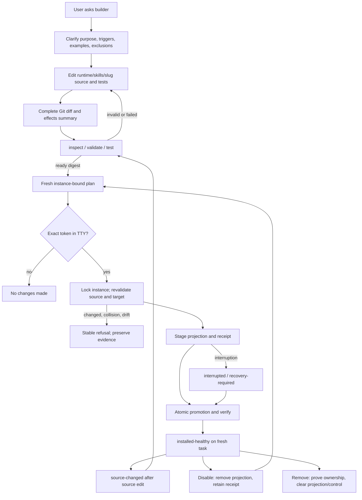

# Technical Design

## Component And Behavior Flow



Before this loop, `capability initialize --runtime PATH` migrates runtime v1 to
v2 with exact `Initialize`; `assistant upgrade NAME` consumes the validated v2
copy and migrates instance v1 to v2 with exact `Upgrade`. Each uses its own lock,
journal, preview, and recovery command. New repositories/instances are created
at v2 and need neither migration.

## State And Data Model

### Runtime source package

```text
runtime/skills/<slug>/
  capability.json
  skill/
    SKILL.md
    references/**        # optional regular UTF-8 files
    assets/**            # optional regular bounded files
  tests/
    cases.json
```

`capability.json` is canonical JSON with contract version, slug, semantic
version, display name, summary, profile=`instruction-only`, Codex compatibility,
triggers, inputs, outputs, success/failure behavior, and fixed declarations:
scripts/dependencies/network/credentials/background/durable-data/publishing all
`none`. `cases.json` declares positive triggers, non-triggers, observable
examples, required package facts, and forbidden effects. Unknown fields fail.

Only regular one-link files and directories are allowed. Paths must be normalized
UTF-8, relative, beneath the package root, and drawn from the allowlist. Symlinks,
hardlinks, devices, sockets, executable mode bits, `scripts/`, user-authored
`agents/openai.yaml`, nested repositories, and unknown entries fail. Counts,
individual size, aggregate size, and depth are bounded constants in the schema
and validator. The implementation plan fixes conservative values in tests and
docs; changing them later is a contract change, not configuration.

The projection contains only `skill/SKILL.md`, allowed resources, and a
My-Friday-rendered `agents/openai.yaml` with
`policy.allow_implicit_invocation: false`. My Friday validates `SKILL.md`
frontmatter name/description against the manifest and rejects unsupported
Codex contract features.

### Installed control state

```text
<instance>/
  workspace/.agents/skills/<slug>/       # active projection, absent if disabled
  capabilities/<slug>/
    receipt.json                         # source version/digest, state, paths
    generations/<digest>/projection/**   # exact retained prior/current bytes
    transaction.json                     # only while pending/recovery-required
```

Instance manifest v2 owns `capabilities` and the reserved builder projection in
addition to the v1 entries. A receipt records contract/profile versions, source
path identity for display, source tree digest, projection digest and file list,
state (`installed` or `disabled`), generation, and transaction identity. It
contains no instruction bodies. Retained generation bytes make disable/re-enable
and recovery source-independent; remove deletes them only after exact proof.

Stable derived states are: `absent`, `draft-invalid`, `draft-valid`,
`test-failed`, `ready`, `installed-healthy`, `source-changed`, `installed-drift`,
`disabled`, `collision`, `interrupted`, `recovery-required`, and `incompatible`.
State is computed from source validation, current-test digest evidence, receipt,
projection, and journal; it is never accepted from a caller.

## Interfaces And Contracts

Bootstrap and migration:

```text
my-friday capability initialize --runtime PATH
my-friday capability recover --runtime PATH --transaction JOURNAL
my-friday assistant upgrade NAME
my-friday assistant recover NAME
```

Read-only package lifecycle, where `NAME` selects the named instance and its
copied runtime source:

```text
my-friday capability inspect NAME SLUG [--plain]
my-friday capability validate NAME SLUG
my-friday capability test NAME SLUG
my-friday capability verify NAME SLUG
```

Mutating lifecycle:

```text
my-friday capability install NAME SLUG     # exact Install
my-friday capability upgrade NAME SLUG     # exact Upgrade
my-friday capability enable NAME SLUG      # exact Enable
my-friday capability disable NAME SLUG     # exact Disable
my-friday capability remove NAME SLUG      # exact Remove
my-friday capability recover NAME SLUG     # exact Recover only when mutation needed
```

`inspect` prints stable state, source and projection paths, full declarations,
version/digests, installed receipt, and test status; it does not print the whole
instruction body by default because the Git diff is authoritative. `--plain`
disables paging/color. `validate` performs structural/Codex checks. `test`
reruns validation plus deterministic cases, identifies that no model was run,
and records no mutable cache; readiness is bound into a later plan by recomputing
the exact tests and digest.

Every mutator builds a fresh immutable plan showing source version/digest,
observed receipt/projection, exact added/replaced/deleted paths, retained
generation, collision/drift checks, and recovery command. A TTY is mandatory.
Return, EOF, interrupt, wrong case, whitespace variants, and other input exit
successfully with `No changes made`. Under the instance-wide advisory lock the
CLI reopens the pinned roots, revalidates the plan observations and tests, then
uses exclusive stage/write/rename/link/unlink operations. A stale plan is never
rebased silently.

The builder skill may run only source-editing and read-only lifecycle commands.
It must show the complete Git diff and unresolved judgments, and it must refuse
to run install/upgrade/enable/disable/remove/recover or supply tokens. This is an
instruction policy backed by acceptance, not an OS security boundary against a
malicious same-UID process.

Stable errors include code, explanation, mutation status, preserved evidence,
and one safest next command. Exit families extend current CLI conventions:
usage/unsupported, invalid, collision/drift, busy/recovery-required, and internal
failure remain distinct.

## Authorization And Data Exposure

| Subject | Action/resource | Decision and scope | Denial/audit |
|---|---|---|---|
| Builder agent | Edit one runtime capability source package | Allowed after clarified instruction-only contract | Git diff; no installed authority |
| User at TTY | Mutate one named instance capability | Exact fresh preview plus exact token | `No changes made`; receipt/journal after first mutation |
| CLI | Read source and mutate owned instance projection/control | Pinned roots, verified manifests, allowlisted paths | Refuse foreign entries, drift, changed root, links, unsupported profile |
| Codex | Load installed skill in a fresh named-instance task | Repository-scoped projection, explicit invocation only | No global skill/config mutation |
| Release acceptor | Use file-backed Codex credential in disposable acceptance | Existing isolated acceptance boundary | No credential content in logs/evidence |

Instruction source and full diffs are user-visible and Git-versioned. Receipts
contain paths/digests/versions but not instruction bodies. Collision and error
messages name paths and prohibited fields without echoing foreign or secret-like
content. C1 never reads `$HOME/.agents/skills` or unrelated Codex configuration.

## Failure, Recovery, And Observability

- Validation/test failure keeps source and creates no plan or installed state.
- Source or target change after preview refuses before mutation.
- Foreign projection content produces `collision` and is untouched.
- Managed projection mismatch produces `installed-drift`; upgrade, disable, and
  remove refuse rather than overwriting evidence.
- Before first mutation, failure leaves no instance changes. After first
  mutation, the durable journal proves either restoration or completion; an
  ambiguous state becomes `recovery-required` and blocks ordinary mutation.
- Recovery reopens pinned roots, validates the body-free journal and generation,
  previews finish/restore, and is idempotent. It never infers ownership from
  byte equality alone.
- Instance removal serializes on the same lock and refuses pending capability
  transactions. Contract-v1 verification/removal remains supported until upgrade.
- Disable removes the active projection and retains receipt/generation. Enable
  restores only the proven retained generation. Remove clears projection and
  capability control but preserves runtime source.
- Logs/transcripts are plain text, stable, ANSI-independent, and body-free for
  receipts/recovery. Status lines state whether mutation occurred.

## Design Traceability

| Acceptance journey | Component/state | Interface | Authority/recovery |
|---|---|---|---|
| Natural define/scaffold/review | built-in builder + source package | ordinary request, Git diff, inspect | source only; agent cannot activate |
| Deterministic validation/test | strict profile validator/cases | validate, test | read-only; exact source digest |
| Safe install/verify | projection planner + receipt | install, verify | TTY exact token; instance lock/journal |
| Enhancement | source-changed → ready → healthy | edit, test, upgrade | fresh Upgrade plan; no in-place edit |
| Disable/remove/re-enable | retained generation/control | disable, enable, remove | exact ownership; source preserved |
| Collision/drift/interruption | derived state + journal | verify, recover | refuse foreign/drift; explicit recovery |
| Existing user migration | runtime v2 + instance v2 | initialize, assistant upgrade | separate exact transactions and rollback evidence |
| Real Codex usefulness | explicit projection on fresh task | `$skill-name` acceptance prompt | immutable candidate, independent acceptor |
