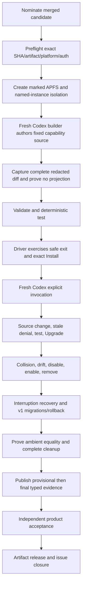

# Technical Design

## Component And Behavior Flow



## State And Data Model

The supervisor owns one random run ID beneath the existing fixed acceptance
parents. Its strict marker binds candidate SHA, artifact authority, issue 51,
nonce, UID/GID, canonical home, root identities, and helper closure. Private
receipts record APFS graph, candidate/runtime/instance roots, source/projection
digests, expected fixture declarations, lifecycle states, protected snapshots,
and exact cleanup entries.

`capability-workshop-acceptance-evidence-v1` has provisional and final forms.
Provisional binds the complete scenario matrix and redacted facts. Final binds
the provisional body digest, final protected-state equality, process
quiescence, ordinary detach, and absence of every run-owned root. A strict
failure form records only candidate/artifact/run, failure class/scope/phase,
and preservation facts; it cannot authorize approval.

Human workshop receipts use a separate
`capability-workshop-partner-receipt-v1` schema bound to issue 51, candidate,
artifact, role (`product-owner` or `design-partner`), completion,
source/projection comprehension, recovery need, and retention decision. Exactly
one product-owner and two distinct design-partner receipts are required.

## Interfaces And Contracts

```text
MY_FRIDAY_RUNTIME_PROJECTION=/absolute/contract-v1-runtime \
MY_FRIDAY_CODEX_AUTH_FILE=/absolute/auth.json \
  bin/accept-capability-workshop 'artifact-v1:...' 51

bin/verify-capability-workshop-evidence <issue> <sha> <artifact>
bin/record-capability-workshop-receipt <issue> <sha> <artifact> <role> ...
```

The supervisor checks clean exact-candidate checkout, latest nomination, safe
toolchain closure, Darwin/ARM64/APFS, TTY, and auth metadata before mutation.
The fixture declares one explicit daily-brief-like instruction capability with
all prohibited effects set to `none`. Fixed prompts and expected tokens prove
builder policy and explicit invocation; CLI transcripts prove state and
lifecycle. Every command is bounded and environment-sanitized.

Product acceptance and `finalize-release` select the issue-51 verifier when the
release issue set contains 51. They require the final evidence plus three human
receipts and reject issue-4 schemas, provisional/failure records, edited or
unstable comments, mismatched PR ancestry, and superseded nomination.

## Authorization And Data Exposure

| Subject | Action | Scope | Denial/evidence |
|---|---|---|---|
| Builder task | Edit and inspect source | Disposable copied runtime only | No lifecycle tokens; diff digest and declarations |
| Driver | Confirm lifecycle operations | One named disposable instance | Exact fresh plan/token; transcript facts |
| Supervisor | Copy auth | Exact proven instance Codex home | No-follow inode receipt; body never logged |
| Acceptor | Publish final evidence | Issue 51 exact candidate/artifact | Authorized actor and stable comments |
| Product/design partners | Record workshop result | Same exact artifact | Typed role receipt; no profiling |
| Release workflow | Publish artifact | Accepted SHA/artifact/issue set | Fail closed on any authority mismatch |

Public evidence contains hashes, versions, state names, scenario results, and
redacted summaries. Full diffs, instruction bodies, auth bytes, private paths,
foreign content, sessions, and model transcripts remain private and are removed
after final proof.

## Failure, Recovery, And Observability

Each phase updates private receipts before mutation. Failure stops exact process
groups, attempts only ordinary detach under revalidated graph authority, removes
only manifest-owned disposable state, preserves ambiguous roots, and publishes
redacted failure authority. A missed interruption observation is retried with a
fresh run, never reinterpreted. Finalization refetches comments twice and can be
retried without rerunning a successful acceptance or rebuilding the artifact.

## Design Traceability

The flow covers authoring/no-activation, diff, validation/test, install and
fresh-task use, enhancement, collision/drift, disable/enable/remove,
interruption, migrations/rollback, ambient preservation, independent workshop
receipts, and exact release binding. Every destructive action is scoped by the
marker/manifest model and every visible acceptance result appears in the typed
provisional/final pair.
