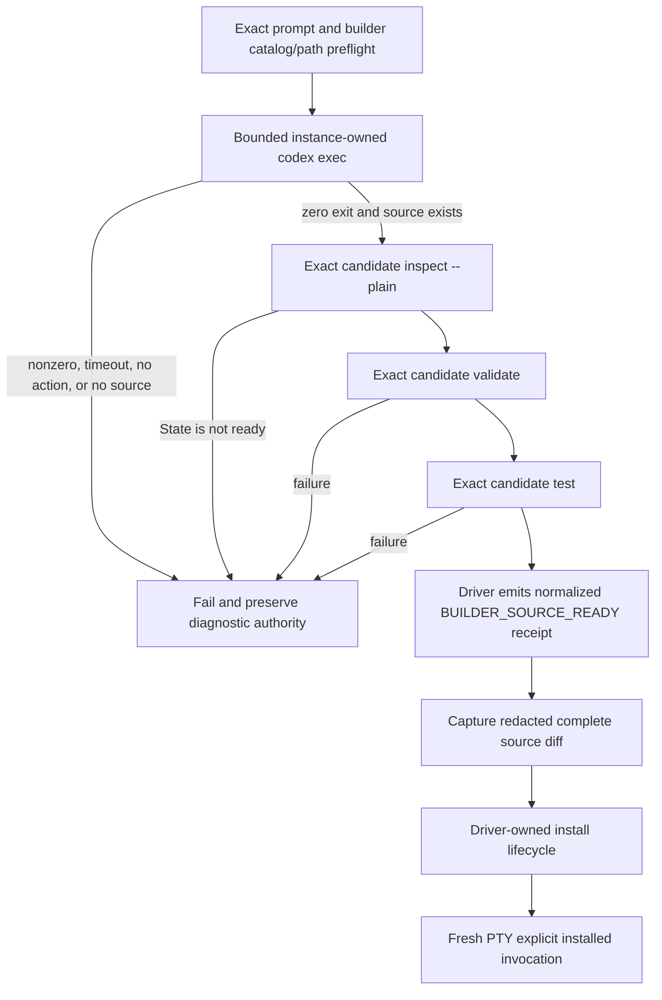

# Technical Design

## Component And Behavior Flow



No model marker appears in the authority chain. A zero `exec` exit is necessary
but insufficient. The driver evaluates all postconditions after Codex and its
descendants are quiescent.

## State And Data Model

The capability package model remains contract v1 with exactly:

- `capability.json`: identity, version, display metadata, `instruction-only`
  profile, `skills-v1` compatibility, triggers, inputs, outputs, success/failure
  behavior, and the seven prohibited-effect declarations fixed to `none`;
- `skill/SKILL.md`: valid skill frontmatter and instructions that support all
  declared facts and expected outputs; and
- `tests/cases.json`: matching positive triggers, disjoint non-triggers,
  trigger-covering examples, required facts, and the complete forbidden-effects
  vocabulary.

The generated builder skill states those fields and relationships in generic
form, names the exact instance/runtime/check commands as today, and may include
one minimal structural example clearly labeled for adaptation. The candidate's
strict parser remains authoritative; the prose contract does not duplicate
validation logic as executable code.

The private `exec` transcript is a run-owned mode-0600 temporary artifact. It
may be inspected structurally for terminal status and evidence that at least one
tool/file action occurred, but its body is never public evidence. The existing
redacted source diff digest remains the public binding.

## Interfaces And Contracts

The builder invocation becomes logically:

```text
CODEX_HOME=<instance-codex-home> <instance-codex> exec --json \
  --cd <instance-workspace> '<literal-$capability-builder prompt>'
```

The implementation must use only flags supported by the instance-owned Codex
and pass the prompt as one safely bounded argument or stdin payload. The
acceptance runner owns timeout, environment, process group, signal forwarding,
descendant reaping, and final quiescence.

Before execution, `debug prompt-input` must continue to bind the exact prompt
digest, one builder catalog entry, and its exact instance skill path. After
execution, a helper performs these atomic logical checks without changing
source:

1. the expected source root exists with no redirecting entry;
2. `capability inspect <instance> <slug> --plain` reports exactly `State: ready`;
3. `capability validate` exits zero; and
4. `capability test` exits zero.

Only then does the driver append `BUILDER_SOURCE_READY` to the owner-only
receipt. The later installed invocation continues through the existing private
PTY capture contract.

## Authorization And Data Exposure

| Subject | Action | Resource/scope | Decision and evidence |
|---|---|---|---|
| Codex builder | Author/read source and run read-only checks | Exact private runtime plus trusted disposable workspace | Instance config and complete builder contract; no lifecycle tokens |
| Acceptance runner | Execute/stop Codex | Exact instance binary/process group, 600-second bound | Exit/event classification and quiescence |
| Completion helper | Inspect source and run candidate checks | Exact slug/source/instance | Normalized receipt only after all postconditions |
| Driver | Confirm lifecycle mutation | Exact disposable instance | Existing fresh plan/token protocol |
| Public evidence | Bind result | Candidate/artifact/helper closure/diff digest | No prompt, model text, paths, package body, or auth bytes |

Auth remains copied by the existing no-content, no-follow absolute-path
boundary. This amendment adds no credential, network, or public data surface.

## Failure, Recovery, And Observability

Malformed private JSON events, nonzero exit, timeout, signal, no observed
action, absent source, non-ready inspect state, validate/test failure, or
postcondition path ambiguity fail the builder phase. Cleanup follows the
existing marked APFS/instance authority and publishes only the strict redacted
failure record. Ambiguous roots remain preserved; failed candidates are never
renominated.

Deterministic tests inject fake `exec` event streams and filesystem/candidate
outcomes to prove each denial. Live probes are disposable and precede candidate
nomination. Operators diagnose from the run ID and private root under the
existing runbook; GitHub evidence never includes raw model content.

## Design Traceability

Complete builder instructions address the observed missing contract. Native
`exec`, explicit mention/catalog binding, action observation, source existence,
and candidate checks prove agent authorship without activation. Driver-owned
lifecycle, fresh PTY invocation, redacted diff, APFS isolation, migration,
collision/drift, reversal, interruption recovery, ambient equality, typed
evidence, partner receipts, and immutable release binding remain as designed in
#57.
