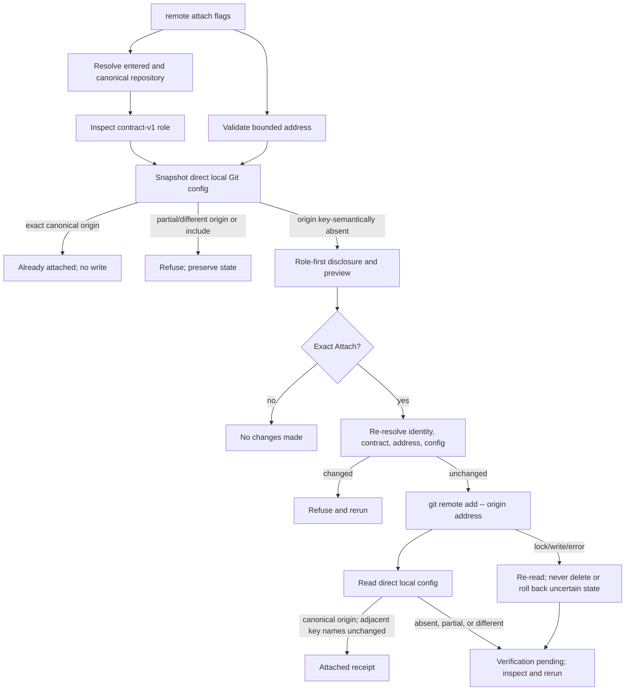

# Technical Design

## Component And Behavior Flow



All work is synchronous and foreground-only. The preview always labels the
role before consequences. Exact repeat short-circuits before confirmation or
lock. Cancel paths perform no config subprocess capable of writing.

The command revalidates after confirmation: entered-to-canonical mapping,
working-tree and `.git` device/inode/type/owner, contract files and role,
address classification, complete direct-local config snapshot, config file
identity/mode/size/mtime, and absence of a config lock at the observed instant.
Any change refuses. Git remains authoritative for lock acquisition; My Friday
never creates, steals, waits on, or removes `.git/config.lock` itself.

The repository root and `.git` directory remain open while planning/execution
facts are compared. Git receives the canonical path as one literal argv value.
Immediately after the subprocess, inode and config state are re-read. This
prevents false success and detects ordinary concurrent replacement; it does not
claim an adversarial sandbox against a privileged actor replacing a path during
the external Git process.

## State And Data Model

### Repository identity

`repository.InspectOne(path)` returns an immutable value:

- entered and canonical path;
- role `runtime` or `memory`;
- assistant ID and contract version;
- manifest/schema/profile digests needed to detect change;
- working-tree and `.git` device/inode/owner/type identities; and
- validated local Git-repository status.

It factors the current ordinary `validate` logic. It does not require the pair,
an unborn branch, no commits, or no remotes. It rejects creation markers,
unknown owned paths, tampered schemas/manifests/profiles, bare/separate Git dirs,
unsupported contract versions, and non-local `.git` resolution. A symlinked
entered path is allowed only when the resolved canonical repository satisfies
the same contract; both values are shown.

### Remote address value

`remoteaddress.Address` contains only the original accepted string and a kind
(`https`, `ssh-url`, `ssh-scp`). Parsing is pure, bounded in length, and rejects
non-ASCII or unsafe structure before any repository/Git mutation. It has one
display representation: the exact accepted string.

No value object is constructed for rejected input. Error values contain a
stable reason category and generic correction guidance, never raw input or a
derived digest. The process retains the CLI argument only for its lifetime.

### Direct-local config snapshot

`remoteconfig.Snapshot` is an in-memory NUL-safe parse of direct local config
with includes disabled. It records:

- config file identity, mode, byte length, and modification time for ordinary
  change detection;
- direct local key names only, in exact order, for include detection, remote-name
  extraction, and before/after adjacent-name comparison;
- safely printable semantic remote names derived from Git/key names; and
- only the `remote.origin.*` values required to classify its complete
  multivalue shape.

It never requests, hashes, or retains values from other remote subsections or
non-origin keys. Git necessarily parses the selected local config internally,
but name-only inspection prevents adjacent values from crossing the subprocess
output boundary. System/global config is never read. The snapshot is not
serialized or logged. A direct include directive, invalid/corrupt config,
duplicate key ambiguity, unsafe remote name, or unreadable config is a refusal.

Empty, comment-only, or duplicate-empty `[remote "origin"]` sections emit no
key and do not make `git remote` report `origin`; they are deliberately outside
the semantic state model. My Friday neither discovers nor parses that text. Git
may reuse it when adding the canonical keys. Native fixtures bind the supported
Git floor/current versions to exact semantic read-back and preservation of all
pre-existing comments and adjacent fixture bytes.

`origin` has three states:

1. `absent`: no direct local `remote.origin.*` key and no semantic `origin` in
   Git's remote-name output; empty/comment-only section text is permitted;
2. `canonical`: exactly one URL equal to the supplied accepted address, exactly
   one fetch refspec `+refs/heads/*:refs/remotes/origin/*`, and no other
   `remote.origin.*` key; or
3. `collision`: every other key-semantic shape, including URL-only partial
   state, duplicated URL/fetch keys, push URL, a different address, extra origin
   controls, or unsafe value.

The capability owns no state after the Git command. The canonical pair in
`.git/config` is the complete durable result.

### Invariants

1. No Git process receives an unaccepted address.
2. No shell parses a repository path, address, remote name, or config value.
3. A write is attempted only from exact absent `origin` after exact `Attach` and
   a matching post-confirmation snapshot.
4. Success requires the canonical pair, unchanged adjacent key-name inventory,
   matching config/repository identity metadata, and exact URL read-back. Git's
   own command contract plus fixture byte comparisons prove that adjacent values
   are preserved without production code reading them.
5. The other repository is neither discovered nor addressable by the command.
6. Repository contents, index, refs, objects, HEAD, hooks, attributes, modes,
   global/system Git config, and credentials remain unchanged.
7. An uncertain result is preserved; My Friday never speculatively removes an
   `origin` it cannot prove it alone created.
8. Accepted addresses exist durably only in the selected `.git/config` and any
   terminal/shell history controlled by the user.
9. Verification of the literal stored address is never represented as
   verification of a future Git-resolved endpoint.
10. Textual section count or formatting is never treated as ownership or
    collision evidence; only Git-visible direct-local keys/remotes decide state.

## Interfaces And Contracts

### Command grammar

```text
my-friday remote attach --repository PATH --url REMOTE_ADDRESS
```

The command requires both named flags exactly once and rejects extra flags or
positionals before repository inspection. The remote name is always `origin`.
Production requires an interactive terminal capable of collecting the final
line; automated tests and acceptance use a PTY. Help states:

- only local repository config changes;
- no destination creation, login, access test, fetch, or push occurs;
- passwords/tokens are prohibited;
- arguments may be visible in process listings and shell history; and
- runtime and memory must be attached separately.

### Address parser

The parser applies this order:

1. enforce nonempty bounded byte length and ASCII-only input;
2. reject NUL, C0/C1/DEL, whitespace, line/paragraph separators, format/bidi
   controls, percent, backslash, query, fragment, and `::` helper delimiter;
3. select only exact lowercase `https://`, `ssh://`, or unambiguous SCP-style
   syntax with no slash before its first separator colon;
4. parse and validate host, optional port, SSH username, and nonempty path with
   component-specific start/end and segment rules that reject leading-option,
   dot-segment, and ambiguous local-path shapes; and
5. preserve the original bytes without decoding, normalization, or rewrite.

HTTPS rejects all userinfo. SSH permits username-only identity; a password or
empty/unsafe username is refused. Local paths, drive/UNC forms, file URLs,
plaintext protocols, unknown schemes, and helper forms are never delegated to
Git for interpretation.

### Git adapter

Every subprocess uses literal argv and a fixed environment derived from the
existing `gitexec` boundary plus:

- `GIT_CONFIG_NOSYSTEM=1`;
- `HOME` and `XDG_CONFIG_HOME` set to a process-owned, owner-only, initially
  empty temporary isolation root rather than the invoking user's home;
- no `GIT_CONFIG_COUNT`, `GIT_CONFIG_KEY_*`, or `GIT_CONFIG_VALUE_*` variables;
- stable UTF-8 locale; and
- no askpass/credential or network command.

The adapter creates the empty isolation root before Git, verifies it contains
no configuration, and removes only that exact empty tool-owned root afterward.
An interrupted run can leave an empty private temporary directory but no Git
configuration or credential. This mechanism is available at the Git 2.28 floor
and does not depend on the newer `GIT_CONFIG_GLOBAL` override. Compatibility
tests execute the adapter with Git 2.28 as well as the native supported Git.

Inspection uses `git -C <canonical> config --local --no-includes` with NUL
output and explicit keys/regex. Mutation is exactly:

```text
git -C <canonical> remote add -- origin <accepted-address>
```

`--` prevents option interpretation; argv is not a command string. `-f`,
`--mirror`, tag options, custom refspecs, and every network operation are absent.

Read-back uses direct local config, not `git remote get-url`, because Git can
expand `insteadOf` values. It verifies one exact URL and the canonical fetch
refspec. The adapter separately checks adjacent key names and config/repository
identity metadata before emitting success; it does not pull unrelated values
across the subprocess boundary for comparison.

This verifies the value stored in the selected repository, not the endpoint a
future Git operation will resolve. Later user-directed Git may apply local,
global, or system `url.*.insteadOf`/`pushInsteadOf` rules. My Friday neither
reads those external scopes nor claims to verify their eventual destination.

### Preview and confirmation

The preview uses the product-experience hierarchy:

```text
Attach Git remote

Repository role: Runtime
Repository entered: <entered path>
Repository canonical: <canonical path>
Remote name: origin
Remote address: <accepted address>

This changes only this repository's local Git configuration.

Future Git commands may send this repository's committed content and history
to the configured destination. Runtime and memory repositories can contain
different information; attach only the repository whose sharing policy you
accept.

Your other Git configuration may rewrite this address for later fetch or push.
My Friday stores and verifies the local address shown above; it does not inspect
or verify the endpoint that a future Git command will resolve.

My Friday will not create or log in to a hosted repository, test the connection,
store credentials, change permissions, commit, fetch, push, or modify the other
My Friday repository.

You remain responsible for the destination's ownership, visibility, retention,
credentials, permissions, and provider policy.

Attach this Runtime repository to origin?
Type Attach; default Exit:
```

Memory substitutes `Memory` in both locations. Return, EOF, `q`, wrong case,
leading/trailing whitespace, and every other response print `No changes made`
and return success. The complete disclosure appears on every mutating attempt.

### Receipts and errors

Success prints role, canonical repository, `origin`, exact accepted address,
and the facts: local Git config only, network none, credentials stored none,
remote access not verified, future resolved endpoint not verified, other
repository unchanged. It provides a
shell-quoted inspection command containing only the canonical path and fixed
remote name, never the address.

Exact canonical state prints `Already attached` and the same non-effect facts
without confirmation or write. A different/partial origin prints a collision,
states nothing was overwritten, and gives address-free inspection/removal
guidance. A safely parsed existing address may show scheme/host only; any
unsafe or credential-capable value is simply `<redacted>` and is never hashed.

Stable nonzero categories distinguish `input.invalid`,
`repository.validation`, `remote.address_unsafe`, `remote.collision`,
`git.configuration`, and `git.verification_pending`. Normal errors contain no
stack trace, raw unsafe address, config contents, or credential-shaped value.

### Idempotency and uncertain results

- Exact repeat is `Already attached`, with no write or config mtime change.
- A Git nonzero result triggers read-only reinspection. Even if state now looks
  canonical, the invocation reports verification pending rather than claiming
  authorship; the next exact rerun resolves to `Already attached`.
- A success exit with noncanonical read-back reports verification pending and
  retains state. It never automatically removes `origin`.
- An absent unchanged snapshot after lock/permission failure reports the typed
  Git failure and advises waiting/fixing permissions then rerunning.
- Corrupt/included/partial config is preserved for direct Git diagnosis.

## Authorization And Data Exposure

| Subject | Action/resource | Condition | Denial/evidence |
|---|---|---|---|
| Current non-root user | Select one repository | Canonical contract-v1 runtime or memory under supported environment | Typed validation; no Git write |
| My Friday parser | Accept remote address | Exact bounded HTTPS/SSH grammar, no credential channel | Generic unsafe-address error; raw value suppressed |
| My Friday process | Inspect direct local config | Repository identity pinned; includes/system/global disabled | Invalid/include/collision refusal |
| My Friday process | Add local `origin` | Absent snapshot, exact disclosure/confirmation, matching revalidation | Git lock/write error preserved |
| Independent acceptor | Observe candidate effects | Fixture repos/addresses under disposable identity | Sanitized transcript/manifests only |
| Acceptance supervisor | Deny/trace disposable-UID network use | Physical operator admin authentication; unique marker-bound UID/run anchor; candidate remains unprivileged | PF/DTrace positive control, zero candidate events/counters, exact cleanup receipt |

The command requests no admin, network, provider, keychain, credential helper,
global Git, filesystem permission, or second-repository authority. The
acceptance supervisor uses physical operator admin authentication outside My
Friday to provision/tear down the marker-bounded disposable identity, load and
remove its one PF anchor, and run DTrace. It starts the candidate as the
non-admin UID without privileged file descriptors, tokens, or environment.

No telemetry exists. Foreground output may contain accepted fixture/user
addresses; durable repository evidence must contain only `example.invalid`
fixtures and sanitized temporary paths. Rejected inputs, real private addresses,
config contents, shell history, process listings, and environment values never
enter CI annotations, issue comments, acceptance manifests, or release receipts.

## Failure, Recovery, And Observability

- Missing/extra flags, unsafe address, unsupported terminal/environment, and
  repository validation fail before mutation.
- Existing other remote names are printed safely and do not block attachment;
  any `origin` ambiguity blocks without overwrite.
- Git invalid-config, config-lock, and permission exit statuses map to stable
  categories. My Friday never chmods config, elevates, deletes a lock, repairs
  syntax, or retries a write automatically.
- A concurrent change between preview and confirmation refuses before write.
  A race during Git execution is diagnosed by post-readback and never produces
  a false success.
- Interruption recovery is rerun-based: absent proceeds; exact is already
  attached; partial/different is collision. No journal is necessary because Git
  owns its one-file lock/update and ambiguous state is never auto-deleted.
- Observability is the terminal receipt, stable category, Git inspection
  command, scrubbed subprocess observer in tests, and sanitized exact-head/
  candidate evidence. The observer proves argv/environment only. Acceptance PF
  counters and DTrace resolver/IPv4/IPv6 socket events provide the separate
  child-inclusive network proof. There is no product log or background report.
- Output is plain UTF-8 with no ANSI, cursor movement, spinner, animation, or
  timing-only state. Values occupy labeled lines, wrap naturally at 80 columns,
  and remain understandable in screen-reader order. English-only is the pilot
  limitation; copy remains externalizable.

## Design Traceability

| Acceptance/critical journey | Component/state | Interface | Authority/recovery |
|---|---|---|---|
| One recognized role per invocation | `InspectOne` identity | explicit `--repository` | contract validation; no sibling discovery |
| Generic credential-free address | pure bounded parser | explicit `--url` | reject before Git; unsafe value suppressed |
| Complete disclosure | role-first preview | terminal flow | exact `Attach`; safe default |
| Local `origin` only | direct-local absent snapshot | literal `remote add --` | no `-f`; canonical read-back and adjacent-name preservation |
| Empty/comment-only origin text | key-semantic absence | native Git add/read-back | no raw parser; comments/adjacent bytes preserved in fixtures |
| Repeat/collision | canonical/absent/collision states | preflight and rerun | read-only repeat; refuse overwrite |
| Lock/interruption/TOCTOU | Git lock plus before/after identity | adapter | preserve state; inspect and rerun |
| No adjacent effects | fixed argv/env and single selected root | observer/manifests plus PF/DTrace acceptance | argv proof distinct from child-inclusive network proof |
| Privacy-safe output | accepted vs unsafe display policy | errors/transcripts | no raw unsafe or durable real address |
| Address rewrite boundary | literal local read-back | preview and receipt | future Git resolution remains user-owned/unverified |
| Accessible terminal flow | line-oriented copy and PTY | all states | 80-column/screen-reader review |
| Exact release | artifact candidate identity | nomination/acceptance/release | same digest bytes and fresh evidence |
