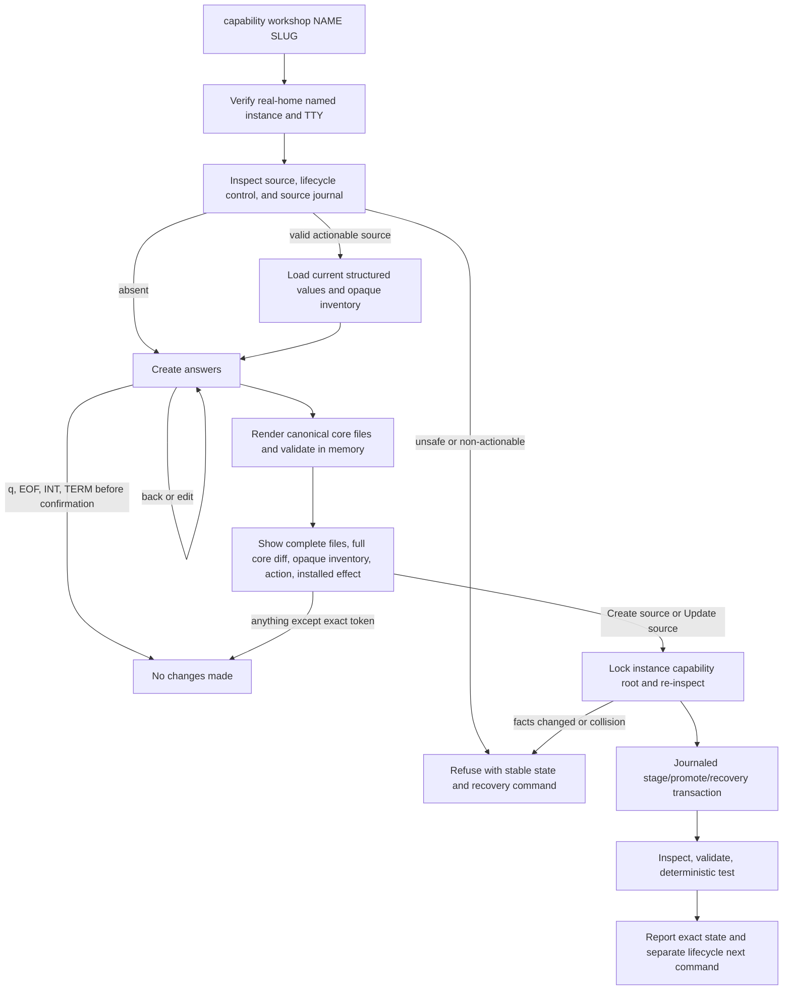

# Technical Design

## Component And Behavior Flow



Questions and preview are read-only. The exact token authorizes only the bytes
shown in the current preview. The commit path recomputes their digest and all
preconditions under the same non-blocking lock used by lifecycle mutations.

## State And Data Model

`capabilityworkshop.Proposal` is an unexported/internal value containing the
current contract-v1 fields required to render:

- `capability.json`: fixed contract/profile/compatibility/prohibited effects;
  explicit slug, semantic version, display name, summary, triggers, inputs,
  outputs, success behavior, and failure behavior;
- `skill/SKILL.md`: fixed frontmatter from slug/summary and either a canonical
  body with explicit Purpose, Inputs, Outputs, Success, Failure, and Required
  facts sections for creation, or the exact existing body for enhancement; and
- `tests/cases.json`: positive triggers equal to manifest triggers, explicit
  disjoint non-triggers, one or more examples with expected output fragments,
  explicit required facts, and the fixed seven forbidden effects.

JSON uses deterministic indentation, field order from typed structs, UTF-8,
and a final newline. Markdown uses a fixed section order and final newline.
Lists retain user order after trim/duplicate validation so preview matches the
conversation; contract tests compare normalized trigger membership.

Create starts with version `0.1.0` and a display name derived from the slug,
both shown as safe editable defaults. All behavioral fields require explicit
answers. Enhancement starts from parsed manifest/case values; empty input means
retain only when the prompt displays that current value. The existing SKILL
body is treated as user-authored content, not parsed into invented sections.
`Retain instruction body` is the enhancement default. `Regenerate instruction
body` explicitly replaces it with the canonical body assembled from reviewed
answers and is visible as a complete core-file diff. Frontmatter may be
canonically updated while the body after the closing delimiter remains exact.
List editing supports add, replace, remove, retain, `b` to the prior section,
and final section restart. There is no invisible merge.

Workshop input bounds are stricter than package storage bounds so full terminal
review remains practical:

- display name and summary: one trimmed line, 1–200 UTF-8 bytes, with control
  characters refused;
- purpose, success behavior, and failure behavior: one trimmed line each,
  1–1,000 UTF-8 bytes;
- triggers and non-triggers: 1–16 entries each, 1–256 UTF-8 bytes per entry;
- inputs and outputs: an explicit `none` choice or 1–16 entries each, 1–256
  UTF-8 bytes per entry;
- examples: 1–16, each with a 1–512-byte input and 1–8 output fragments of
  1–256 bytes each; and
- required facts: 1–16 entries of 1–512 UTF-8 bytes each.

All counts, rendered core-file sizes, and total package size must also satisfy
the existing capability constants. The interface reports byte limits as UTF-8
bytes and never truncates input. Exact `b` and `q` are reserved navigation
commands only at value/list prompts and are named before input; a value that
must literally equal one of them is outside the v1 workshop but remains
representable by direct source ownership.

`SourcePlan` binds action, instance root, source path, pre-state, existing
source digest or absence, proposed core-file digest, preserved optional-file
digests, complete proposed package digest, installed/control facts, and preview
digest. It is not serialized as a public format.

After confirmation, a canonical owner-only source journal is created at
`capabilities/.workshop-<slug>.json` beneath the instance authority root with
action, slug, source path,
old/new tree digests, fixed stage/rollback names, phase, and relevant inode
facts. Staged and rollback trees are the deterministic siblings
`runtime/skills/.<slug>.workshop-new` and
`runtime/skills/.<slug>.workshop-old`; unexpected entries at any authority path
are collisions. Dot-prefixed workshop authority names cannot be valid
capability slugs. A live journal makes assistant rollback and every workshop or
lifecycle mutation refuse until source recovery completes.
Create uses no-replace promotion. Update stages a complete new tree including
byte-identical optional files, quarantines the exact old tree, promotes the new
tree, verifies it, and then removes the exact digest/inode-proven quarantine.
Journal and directory writes are synced at authority transitions.

Recovery under the instance lock deterministically finishes a proven promoted
new tree or restores the proven old tree. It never guesses, follows links,
recursively targets a broad root, or deletes an unbound entry. Ambiguity is
reported as source-workshop recovery required and preserved for diagnosis.
Lifecycle receipt/generation state remains unchanged.

Allowed pre-states are `absent` for create and `ready`, `installed-healthy`,
`source-changed`, or `disabled` for update. The workshop refuses
`draft-invalid`, `draft-valid`, `test-failed`, `installed-drift`, `collision`,
`interrupted`, `recovery-required`, and `incompatible`. Post-state is `ready`
for uninstalled source, `source-changed` for an active installed projection,
and `disabled` for a disabled projection. An already `source-changed` package
remains `source-changed` with the newly proposed digest.

`capability.Inspect` and every lifecycle `Plan`/`Execute` recheck the exact
per-slug source-journal path. A canonical valid journal has precedence over
source/package state and reports the existing `interrupted` state; a malformed,
unsafe, or contradictory journal reports `recovery-required`. The stable
guidance is to rerun `capability workshop NAME SLUG`, which takes the shared
lock, performs only digest/inode-proven source recovery, reports the recovered
state, and exits before collecting new answers. Existing `capability recover`
continues to mean lifecycle projection recovery and never gains source-write or
source-delete authority.

## Interfaces And Contracts

```text
my-friday capability workshop NAME SLUG
```

No flags or noninteractive mode ship. The command requires an interactive
stdin terminal, derives the real account home, verifies `NAME`, validates
`SLUG` through the package's canonical slug rule, and writes prompts/preview to
stdout. It returns existing stable usage/state/mutation error categories where
possible; source collision/recovery errors receive stable capability-state
messages rather than leaking private paths.

The fixed section order is:

1. identity: display name, summary, version;
2. behavior: purpose/instructions, success, failure;
3. invocation: one or more triggers and non-triggers;
4. contract: inputs and outputs;
5. examples: trigger-containing input and one or more output fragments;
6. facts: one or more required facts; and
7. fixed effects: seven prohibited effects displayed as `none`.

Every prompt states format, bounds, current/default behavior, and navigation.
Secret input is never requested. Color may decorate but never encode state.
Output wraps naturally and never truncates canonical bytes, diff lines, action,
installed effect, or confirmation token.

In enhancement, the behavior section first identifies the instruction body as
`retained user-authored content` and offers only retain or regenerate. It does
not print the body twice during questions; the complete final source and diff
remain the authoritative review surface.

Final preview prints stable numbered file headings followed by complete
canonical file bodies, then a full unified diff against `/dev/null` for create
or existing core files for update. Optional files are listed by relative path,
size, and digest as unchanged; their contents are not repeated. It ends with:

```text
Source action: create|update
Installed: no|unchanged
Current state: <state>
Post-write state: <state>
Type Create source|Update source to continue; Return exits:
```

Confirmation is exact, case-sensitive, newline-terminated, and unpadded.
Postconditions call the package APIs directly, not a subprocess, so the exact
candidate owns inspect/validate/test results without parsing its own prose.
The success report includes state, source digest, deterministic case counts,
`Installed: no|unchanged`, and the next explicit command. It never automatically
runs Install, Upgrade, or Enable.

Implementation should expose narrow capability helpers for canonical slug
validation and package rendering/validation only when needed. Do not export the
proposal schema or weaken `Validate` by maintaining a second validator.

## Authorization And Data Exposure

| Subject | Action | Resource/scope | Decision, denial, evidence |
|---|---|---|---|
| User | Supply answers and confirm source | Exact named instance and slug | Exact post-preview token only; default exit |
| Workshop UI | Read existing source and print preview | Three core files plus opaque metadata | Verified regular bounded files; terminal only |
| Source transaction | Create/update source | Exact runtime `skills/<slug>` and fixed journal/stage paths | Same instance lock, no-follow, owner/mode/link/inode/digest proof |
| Workshop | Preserve optional bytes | Existing `skill/references` and `skill/assets` | Byte-copy under verified package bounds; contents not separately interpreted |
| Workshop | Inspect/validate/test | Proposed exact source | Deterministic local APIs; no model/network/credential |
| Lifecycle | Install/upgrade/enable | Existing projection/control | Unchanged separate plan and token |
| Public acceptance | Record completion | Exact candidate/artifact and typed scenario facts | Digests/booleans only; no source, answer, diff, path, prompt, or transcript |

The command receives no credential and introduces no new network, config,
plugin, process, or external-system boundary. The old private builder skill may
describe how to launch the deterministic workshop but has no independent source
or lifecycle authority.

## Failure, Recovery, And Observability

Answer validation remains in the current section and names the violated bound.
Cross-field contradictions return to the relevant section before preview.
Rendering must pass the exact package validator and deterministic tests in a
private temporary tree before any confirmation prompt; an internal mismatch is
a candidate defect and writes nothing.

`b`, `q`, default Return, EOF, `INT`, and `TERM` before exact confirmation print
or imply `No changes made` and leave no journal/stage. Once confirmation is
accepted, signal handling defers termination across the short source commit and
post-commit authority flush. Faults leave a canonical journal; the next
workshop invocation reports and, when exact proofs permit, performs bounded
recovery before asking questions. Ambiguous authority never auto-cleans.

Concurrent workshop/lifecycle execution fails fast on the shared lock. A change
between preview and lock acquisition fails stale without a write. Invalid
source, lifecycle transaction, installed drift, foreign projection/control,
unsafe optional entry, source-stage collision, journal drift, and inode/digest
mismatch all fail closed with stable state and recovery guidance.

No analytics or persistent answer log exists. Private acceptance may retain
owner-only terminal evidence under the existing marked-run boundary; public
evidence contains only candidate/artifact identity, scenario booleans, state
names, counts, and redacted digests.

## Design Traceability

- Create/update, navigation, interruption, review, and exact consent are owned
  by the terminal interaction plus `SourcePlan`.
- Exact bytes, no hidden defaults, and one package authority are owned by the
  canonical renderer followed by `capability.Validate`/`TestCases`.
- Collision, drift, concurrency, atomicity, and recovery are owned by shared
  locking and the source-specific journal/stage/quarantine protocol.
- Opaque preservation is owned by verified package loading, digest-bound copy,
  preview inventory, and post-write equality tests.
- No activation is enforced by package boundaries: workshop code has no call to
  lifecycle `Execute`, and success reports only a separate next command.
- Full reversal, ambient preservation, receipts, candidate binding, and release
  reuse the #51 lifecycle and artifact authority with the builder scenarios
  replaced by deterministic workshop scenarios.
