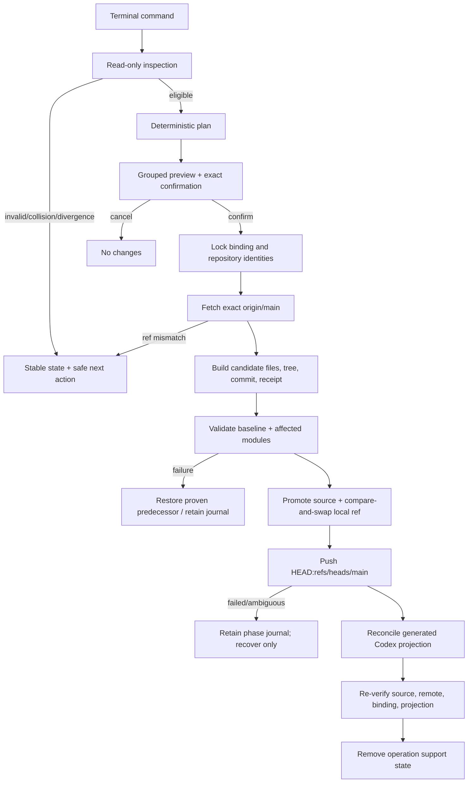

# Technical Design

## Component And Behavior Flow



No network call occurs before the command identifies the configured endpoint
and intended operation. Read-only `inspect` does not fetch; strict `verify` may
use `--remote` to fetch and compare, while its default reports the last verified
remote receipt separately from local contract health. Mutating plans always
fetch immediately before candidate construction.

## State And Data Model

### Canonical repository layout

```text
<assistant-repository>/
├── .my-friday/
│   ├── baseline.json
│   ├── modules.json
│   ├── migrations/
│   ├── receipts/
│   └── schemas/
├── config/
│   ├── assistant.json
│   └── README.md
├── memory/
│   ├── manifest.json
│   └── README.md
└── capabilities/
    ├── manifest.json
    └── README.md
```

All B1-owned files are canonical UTF-8 JSON/Markdown regular files beneath
owner-only directories. JSON uses embedded schemas, unknown fields are denied,
and semantic validation follows byte/schema authentication. `memory/` and
`capabilities/` are empty governed ports in a fresh B1 repository; B2 and B3
extend their versions through declared migrations.

### Records

| Record | Owner | Essential fields |
|---|---|---|
| Baseline manifest | repository | contract version, assistant ID, baseline version, module versions, minimum/creating tool versions |
| Module registry | repository | exact module path, schema version, authority class, migration head, removal policy |
| Assistant config | config module | non-secret identity/presentation values and selected harness; no endpoint or credentials |
| Module manifest | module | contract/schema version, module ID, data/source class, compatible kernel range |
| Canonical receipt | repository | operation ID/type, predecessor commit/tree, planned path digests, resulting module/baseline versions, migration IDs; excludes its own digest and secrets |
| Migration | embedded tool + recorded application | stable ID, from/to versions, preconditions, touched paths, forward/inverse support, validation set |
| Host binding | generated local state | name, assistant ID, canonical no-follow path identity, designated remote/ref, endpoint hash, current source commit, projection generation/digests |
| Operation journal | generated local state | plan digest, confirmation, before/candidate proofs, commit, phases, remote observations, projection proofs, recovery disposition |

The canonical receipt is committed with the semantic change. The local journal
binds the resulting commit and remote push; avoiding the commit SHA inside the
committed receipt prevents a circular tree hash. Successful final verification
may persist a replaceable host receipt in the binding.

### Invariants

- One assistant ID binds repository, three module manifests, host binding, and
  generated projection.
- The active canonical checkout is a non-symlink, current-user-owned directory
  on branch `main`, with no staged, modified, untracked, conflicted, ignored-
  owned, or in-progress Git operation state.
- `origin` is the sole designated automatic-write remote. The binding hashes
  its normalized endpoint and fixes `refs/heads/main`.
- Before mutation, local HEAD equals fetched `refs/remotes/origin/main`, except
  initial creation where the remote has no refs.
- A plan names every file addition, replacement, and removal. Unnamed path or
  metadata change invalidates the plan.
- Each module validator is selected by its manifest version. The kernel invokes
  only affected-module validators plus cross-module/baseline validation.
- Canonical repository paths never appear under generated-root removal
  authority.
- A journal is single-use and plan-bound. Ordinary mutation refuses while a
  journal or authenticated quarantine exists.

### Migration and rollback

Fresh creation emits baseline v1 with module registry v1 and empty B1 ports.
Legacy migration requires a valid released repository pair and, when present,
a valid named instance. It maps profile data to `config/assistant.json`,
instruction-only skills to `capabilities/`, and memory repository content to
`memory/`; path conflicts or unknown legacy contracts refuse. The import
receipt records legacy assistant ID, roles, contract versions, HEADs when
present, and tree digests, but no absolute legacy paths.

Baseline upgrade resolves an exact contiguous embedded migration chain.
Rollback is available only when each crossed migration declares and passes a
lossless inverse for the current data. It writes a new canonical receipt and
commit. An incompatible later module/data version refuses and recommends the
last compatible tool; neither Git reset nor remote ref reversal is offered.

## Interfaces And Contracts

### Commands

| Command | Contract |
|---|---|
| `assistant create NAME --repository PATH --remote URL` | Preflight empty target/remote, preview complete baseline/host/Git plan, exact `Create`, push and activate |
| `assistant migrate NAME --runtime PATH --memory PATH --repository PATH --remote URL` | Validate released legacy pair, preview mapping/preservation, exact `Migrate`, push new source, switch only after verification |
| `assistant inspect NAME [--json]` | Local read-only state including repository, versions, binding, projection, Git worktree, last remote verification, and recovery need |
| `assistant verify NAME [--remote] [--json]` | Strict contract verification; optional bounded fetch proves current designated remote ref |
| `assistant diagnose NAME [--json]` | Stable state/error classification and one or more safe next commands; never mutates or reads secrets |
| `assistant reconcile NAME` | Preview generated-state changes needed to match healthy canonical source; exact `Reconcile` |
| `assistant repair NAME` | Repair only drifted manifest-owned generated bytes from the bound canonical commit; exact `Repair` |
| `assistant upgrade NAME` | Apply the contiguous baseline migration chain, commit/push, then reconcile projection; exact `Upgrade` |
| `assistant rollback NAME --to VERSION` | Apply only a proven lossless inverse chain as a new commit; exact `Rollback` |
| `assistant remove NAME` | Detach and remove only verified generated host state; preserve repository/remote; exact `Remove` |
| `assistant recover NAME` | Authenticate the retained journal and complete/restore the unique safe phase; exact `Recover` |

All mutation previews use the same order: identity and current state; canonical
file changes; module migrations; Git commit/push; generated state; preserved
state; prohibited effects; recovery path; confirmation. Paths occupy distinct
lines and output does not depend on colour. `--json` is read-only in B1 so an
automation cannot bypass interactive mutation authority.

Existing split commands remain available for verify/recover/migration during a
documented compatibility window. New split creation is deprecated once B1 is
released; an existing exact invocation may continue only long enough to avoid
stranding the previously accepted F0 lifecycle. Help and diagnostics point to
canonical migration without silently changing arguments.

### Stable states and errors

Top-level states are `healthy`, `not-configured`, `legacy`, `source-drift`,
`projection-drift`, `interrupted`, `behind-remote`, `ahead-unpushed`,
`diverged`, `collision`, `incompatible`, and `dependency-missing`. Machine
output carries contract version, stable code, summary, affected boundary, and
safe next actions. Human errors retain the existing `Error [code]: detail`
shape. Remote errors redact URL userinfo/query and credential-helper output
patterns before display or journal persistence.

### Git adapter

- Accept only normalized `https://`, `ssh://`, or SCP-like SSH endpoints with
  no password, token, query, fragment, `ext::`, shell metacharacter, or local
  filesystem transport.
- Invoke Git with an explicit repository, designated remote/ref, fixed
  noninteractive timeout for lifecycle writes, empty hooks path, disabled
  optional locks where unsafe, and no credential variables in logs/evidence.
- Construct candidate blobs/tree from exact bytes without applying repository
  clean/smudge filters. Refuse attributes or config that assign filters to
  B1-owned paths.
- Resolve author/committer identity from ordinary Git configuration during
  preflight; never invent a service identity or store email in product policy.
- Use a deterministic subject with an operation ID trailer; timestamps and
  commit SHA are evidence, not plan determinism.
- Fetch only the designated branch; compare exact object IDs; push only the
  candidate commit to `refs/heads/main`; reread remote state after ambiguous
  transport failure before deciding whether recovery may continue.

## Authorization And Data Exposure

| Subject | Action/resource | Allow condition | Denial and evidence |
|---|---|---|---|
| User | confirm mutation | Interactive TTY and exact action token after complete preview | Any other input exits unchanged |
| Kernel | canonical files | Current-user/no-follow repository, clean exact HEAD, valid manifests, declared path plan, held identity lock | Preserve state; stable collision/drift code |
| Repository steward | commit/push | Candidate validates, local/upstream/predecessor agree, designated endpoint/ref match binding | No commit on validation failure; journal on post-commit ambiguity |
| Kernel | generated projection | Binding and source commit verify; target entries are manifest-owned | Unknown/drifted entries preserved; repair/remove refused |
| Migration adapter | legacy source | Released schema and complete pair validate; read-only source snapshot stable | No import; old repositories never mutated |
| Codex harness | canonical semantics | Receives generated projection for bound source commit | Projection cannot become canonical authority |

The repository contains private user-authored configuration, capability source,
and later governed memory. It must be private at the remote provider, but B1
cannot independently certify that provider property. Secret values are invalid
in B1 manifests, config, receipts, logs, preview fixtures, and evidence. Git/SSH
credential values remain inside their existing helper/agent boundary.

## Failure, Recovery, And Observability

| Last proven phase | Recovery behavior |
|---|---|
| prepared | Remove only plan-owned staging/support state; active source/ref/remote unchanged |
| source-promoted | Revalidate candidate and predecessor; complete local ref commit or restore exact predecessor bytes |
| ref-committed | If remote still equals predecessor, retry explicit push; if remote equals candidate, advance journal; otherwise refuse divergence |
| remote-pushed | Complete local source/ref alignment and generated projection; never issue a second semantic commit |
| projection-promoted | Reverify source/ref/remote/projection and clean support state |
| verified | Idempotently remove only authenticated journal/quarantine artifacts |

Signals before confirmation exit with no journal. Signals after confirmation
are converted into a bounded stop request at a recorded checkpoint; the command
returns the conventional signal status only after preserving a recoverable
phase. Git and Codex child process groups are bounded and reaped.

Observability consists of stable CLI states, JSON read models, canonical
semantic receipts, local phase journals, Git commits, and remote refs. Journals
record endpoint hashes and sanitized command/error classes, never credential
material or full helper output. `diagnose` distinguishes safe automatic recovery
from user-owned remote reconciliation; divergence never offers an automatic
merge.

## Design Traceability

| Acceptance/critical journey | Component/state | Interface | Recovery proof |
|---|---|---|---|
| Create one repository/three modules | baseline and module manifests | `assistant create` | prepared through verified phase tests |
| Inspect/verify/diagnose | read model and stable states | three read-only commands/JSON | corrupted/missing/legacy/diverged fixtures |
| Reconcile/repair/launch | host binding and projection planner | reconcile, repair, launcher | manifest drift/collision/interruption tests |
| Upgrade/rollback/migrate | migration registry and legacy adapter | upgrade, rollback, migrate | forward/inverse and switch-boundary injection |
| Exact commit/push | repository steward/Git adapter | shared mutation transaction | commit/push ambiguity matrix and remote reread |
| Refuse unsafe Git behavior | clean/ref/transport preflight | all mutations | branch, worktree, hook/filter, remote, divergence adversarial tests |
| Preserve unrelated/canonical data on remove | separate source and generated ownership | `assistant remove` | full-tree canaries and no canonical path in removal plan |
