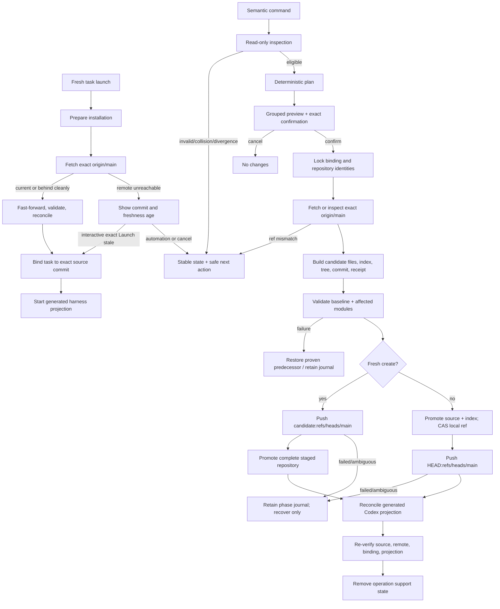

# Technical Design

## Component And Behavior Flow



No network call occurs before the command identifies the configured endpoint
and intended operation. Read-only `inspect` does not fetch; strict `verify` may
use `--remote` to fetch and compare, while its default reports the last verified
remote receipt separately from local contract health. `prepare` and `sync`
automatically fetch, but change only a clean managed checkout and its generated
projection to an already-canonical remote commit; they never push. The launch
receipt binds the task to the fetched commit and observation time. A later
remote advance does not rewrite an active task; the next fresh task prepares
again. Semantic mutation plans always fetch immediately before candidate
construction. Fresh create proves an empty
remote, pushes the staged commit, then promotes the complete staged repository.
Existing-repository mutation atomically promotes planned source entries and a
candidate index, compare-and-swap advances the local ref, then pushes.

## State And Data Model

### Canonical repository layout

```text
<assistant-repository>/
├── .my-friday/
│   ├── baseline.json
│   ├── modules.json
│   ├── migrations/
│   ├── receipts/
│   └── schemas/
├── config/
│   ├── assistant.json
│   └── README.md
├── memory/
│   ├── manifest.json
│   └── README.md
└── capabilities/
    ├── manifest.json
    └── README.md
```

All B1-owned files are canonical UTF-8 JSON/Markdown regular files beneath
owner-only directories. JSON uses embedded schemas, unknown fields are denied,
and semantic validation follows byte/schema authentication. `memory/` and
`capabilities/` are empty governed ports in a fresh B1 repository; B2 and B3
extend their versions through declared migrations.

### Records

| Record | Owner | Essential fields |
|---|---|---|
| Baseline manifest | repository | contract version, assistant ID, baseline version, module versions, minimum/creating tool versions |
| Module registry | repository | exact module path, schema version, authority class, migration head, removal policy |
| Assistant config | config module | non-secret identity/presentation values and selected harness; no endpoint or credentials |
| Module manifest | module | contract/schema version, module ID, data/source class, compatible kernel range |
| Canonical receipt | repository | operation ID/type, predecessor commit/tree, planned path digests, resulting module/baseline versions, migration IDs; excludes its own digest and secrets |
| Migration | embedded tool + recorded application | stable ID, from/to versions, preconditions, touched paths, forward/inverse support, validation set |
| Host binding | generated local state | name, assistant ID, random stable installation ID, operating role, platform profile, local capability availability, secret-slot bindings, canonical no-follow path identity, designated remote/ref, endpoint hash, current source commit, last remote observation, projection generation/digests |
| Launch receipt | generated local state | installation ID, exact source commit, remote observation time/result, stale acceptance when applicable, projection generation; no session transcript or secret values |
| Operation journal | local operation area | name, plan digest, confirmation, before/candidate source/index/ref proofs, commit, phases, remote observations, projection proofs, recovery disposition |

The canonical receipt is committed with the semantic change. The local journal
binds the resulting commit and remote push; avoiding the commit SHA inside the
committed receipt prevents a circular tree hash. Successful final verification
may persist a replaceable host receipt in the binding.

Installation IDs are local opaque identifiers; the canonical repository does
not maintain a roster of machines. Canonical capability declarations may name
required or optional secret slots and effect classes, but their credential
values, sessions, browser profiles, hardware access, and current availability
remain host-local.

The operation area is
`$HOME/.my-friday/operations/<name>/transaction.json`, derived from the current
operating-system account and validated assistant name without trusting `HOME`.
It exists independently of the destination and host binding, is owner-only,
contains no source content or endpoint URL, and is removed only after final
verification. Create, restore, and migration can therefore recover before a
binding exists.

### Generated host layout and launch

```text
$HOME/.my-friday/assistants/<name>/
├── binding.json
├── launch-receipt.json
├── codex/
│   ├── AGENTS.md
│   └── config.toml
├── dependencies/
│   ├── codex
│   ├── codex-code-mode-host
│   └── my-friday
└── workspace/
```

The B1 Codex projection renders identity/presentation from the bound canonical
commit into `codex/AGENTS.md`; it does not copy `config/`, `memory/`, or
`capabilities/` into generated ownership. The launcher preserves the caller's
`HOME`, discards ambient `CODEX_HOME`, sets instance `CODEX_HOME`, runs the
prepare contract, records the exact source commit, and starts the copied Codex
executable in the generated `workspace/`. Later B2/B3 plans
may add compiler or governed port projections, but canonical paths remain
outside generated-root removal authority.

### Invariants

- One assistant ID binds repository, three module manifests, host binding, and
  generated projection.
- The active canonical checkout is a non-symlink, current-user-owned directory
  on branch `main`, with no staged, modified, untracked, conflicted, ignored-
  owned, or in-progress Git operation state.
- `origin` is the sole designated automatic-write remote. The binding hashes
  its normalized endpoint and fixes `refs/heads/main`.
- Before mutation, local HEAD equals fetched `refs/remotes/origin/main`, except
  initial creation where the remote has no refs.
- Before a fresh task, a clean managed checkout is fast-forwarded to the most
  recently fetched `origin/main`, completely validated, reconciled, and bound
  to that exact commit. Offline use requires explicit interactive stale assent.
- Multiple installations may read and run interactive tasks concurrently. B1
  does not authorize a singleton scheduled or externally effectful capability
  on multiple active hosts; its operating role is evidence for later policy,
  not a distributed lease.
- A plan names every file addition, replacement, and removal. Unnamed path or
  metadata change invalidates the plan.
- Each module validator is selected by its manifest version. The kernel invokes
  only affected-module validators plus cross-module/baseline validation.
- Canonical repository paths never appear under generated-root removal
  authority.
- A journal is single-use and plan-bound. Ordinary mutation refuses while a
  journal or authenticated quarantine exists.

### Migration and rollback

Fresh creation emits baseline v1 with module registry v1 and empty B1 ports.
Legacy migration requires a valid released repository pair and, when present,
a valid named instance. It maps profile data to `config/assistant.json`,
instruction-only skills to `capabilities/`, and memory repository content to
`memory/`; path conflicts or unknown legacy contracts refuse. The import
receipt records legacy assistant ID, roles, contract versions, HEADs when
present, and tree digests, but no absolute legacy paths.

Baseline upgrade resolves an exact contiguous embedded migration chain.
Rollback is available only when each crossed migration declares and passes a
lossless inverse for the current data. It writes a new canonical receipt and
commit. An incompatible later module/data version refuses and recommends the
last compatible tool; neither Git reset nor remote ref reversal is offered.

## Interfaces And Contracts

### Commands

| Command | Contract |
|---|---|
| `assistant create NAME --repository PATH --remote URL --remote-private` | Collect and validate the released non-secret assistant profile, preflight empty target/remote, record explicit privacy attestation, preview complete baseline/host/Git plan, exact `Create`, push and activate |
| `assistant restore NAME --repository PATH --remote URL --remote-private` | Preflight empty target and valid canonical remote main, exact `Restore`, clone/validate the existing commit, rebuild local binding/projection without a semantic commit |
| `assistant migrate NAME --runtime PATH --memory PATH --repository PATH --remote URL --remote-private` | Validate released legacy pair, record explicit privacy attestation, preview mapping/preservation, exact `Migrate`, push new source, switch only after verification |
| `assistant prepare NAME [--noninteractive]` | Validate the installation, fetch and cleanly fast-forward the managed checkout, validate source, reconcile projection, and emit the exact task binding; if unreachable, interactive use may enter exact `Launch stale`, while noninteractive use fails |
| `assistant sync NAME` | Run the same fetch, fast-forward, validation, and projection reconciliation without launching a task; never pushes or changes canonical meaning |
| `assistant inspect NAME [--json]` | Local read-only state including repository, versions, binding, projection, Git worktree, last remote verification, and recovery need |
| `assistant verify NAME [--remote] [--json]` | Strict contract verification; optional bounded fetch proves current designated remote ref |
| `assistant diagnose NAME [--json]` | Stable state/error classification and one or more safe next commands; never mutates or reads secrets |
| `assistant reconcile NAME` | Preview generated-state changes needed to match healthy canonical source; exact `Reconcile` |
| `assistant repair NAME` | Repair only drifted manifest-owned generated bytes from the bound canonical commit; exact `Repair` |
| `assistant upgrade NAME` | Apply the contiguous baseline migration chain, commit/push, then reconcile projection; exact `Upgrade` |
| `assistant rollback NAME --to VERSION` | Apply only a proven lossless inverse chain as a new commit; exact `Rollback` |
| `assistant remove NAME` | Detach and remove only verified generated host state; preserve repository/remote; exact `Remove` |
| `assistant recover NAME` | Authenticate the retained journal and complete/restore the unique safe phase; exact `Recover` |

The generated launcher invokes `assistant prepare NAME` before every fresh
task. Automated and scheduled callers use `--noninteractive` and therefore
cannot accept stale state. Successful prepare/sync is automatic only when the
checkout is an exact clean ancestor and the fetched candidate fully validates;
local edits, local-ahead state, divergence, incompatible source, or projection
collision refuse without overwrite.

All semantic mutation previews use the same order: identity and current state;
canonical file changes; module migrations; Git commit/push; generated state;
preserved state; prohibited effects; recovery path; confirmation. Paths occupy
distinct lines and output does not depend on colour. `--json` is read-only in
B1 so an automation cannot bypass interactive mutation authority.

Fresh create reuses the released line-oriented profile questions and their NFC,
grapheme, control-character, style, and policy-boundary rules. Restore reads
that profile from the validated canonical commit and never asks the user to
retype it. Migration maps the validated legacy profile byte-semantically before
showing the normalized destination preview.

`--remote-private` is a required, literal attestation that the user has already
configured a private repository at the supplied non-credential URL. Preview
labels visibility as `user-attested (not provider-verified)`. Absence refuses
before network access. The attestation is recorded as a boolean in the binding
and canonical create/import receipt; endpoint coordinates are not.

`reconcile` applies the complete generated plan needed to represent the current
healthy canonical commit, including legitimate version changes. `repair` is
narrower: it restores drifted manifest-owned generated bytes for the already-
bound commit and refuses if canonical versions or desired projection changed.

Existing split commands remain available for verify/recover/migration during a
documented compatibility window. New split creation is deprecated once B1 is
released; an existing exact invocation may continue only long enough to avoid
stranding the previously accepted F0 lifecycle. Help and diagnostics point to
canonical migration without silently changing arguments.

### Stable states and errors

Top-level states are `healthy`, `not-configured`, `legacy`, `source-drift`,
`projection-drift`, `interrupted`, `behind-remote`, `ahead-unpushed`,
`remote-unreachable`, `stale-ready`, `diverged`, `collision`, `incompatible`,
and `dependency-missing`. Machine
output carries contract version, stable code, summary, affected boundary, and
safe next actions. Human errors retain the existing `Error [code]: detail`
shape. Remote errors redact URL userinfo/query and credential-helper output
patterns before display or journal persistence.

### Git adapter

- Accept only normalized `https://`, `ssh://`, or SCP-like SSH endpoints with
  no password, token, query, fragment, `ext::`, shell metacharacter, or local
  filesystem transport.
- Invoke Git with an explicit repository, designated remote/ref, fixed
  noninteractive timeout for lifecycle writes, empty hooks path, disabled
  optional locks where unsafe, and no credential variables in logs/evidence.
- Construct candidate blobs, index, and tree from exact bytes without applying
  repository clean/smudge filters. Refuse attributes or config that assign
  filters to B1-owned paths. Promote the candidate index under the same journal
  as source bytes and bind its digest in recovery proofs.
- Resolve author/committer identity from ordinary Git configuration during
  preflight; never invent a service identity or store email in product policy.
- Use a deterministic subject with an operation ID trailer; timestamps and
  commit SHA are evidence, not plan determinism.
- Fetch only the designated branch; compare exact object IDs; push only the
  candidate commit to `refs/heads/main`; reread remote state after ambiguous
  transport failure before deciding whether recovery may continue.
- Treat non-force remote ref update as the sole cross-installation writer
  arbitration. An advanced remote refuses every ordinary semantic candidate.
- Permit one replan-and-push attempt only when the complete operation is a new
  immutable content-addressed regular file, its path is absent on the new head,
  its bytes and semantic identity are unchanged, and the complete repository
  validates on that head. Discard the unpublished candidate and reconstruct it;
  never rebase, merge, cherry-pick, or replay replacements automatically.

## Authorization And Data Exposure

| Subject | Action/resource | Allow condition | Denial and evidence |
|---|---|---|---|
| User | confirm mutation | Interactive TTY and exact action token after complete preview | Any other input exits unchanged |
| Installation | refresh local projection | Valid binding, exact clean managed checkout, fetched descendant, full source validation, manifest-owned projection plan | Preserve local state and report drift/divergence; never push |
| Interactive user | launch from stale source | Remote unreachable, last verified commit locally healthy, exact `Launch stale` | Automation and any other input fail closed |
| Kernel | canonical files | Current-user/no-follow repository, clean exact HEAD, valid manifests, declared path plan, held identity lock | Preserve state; stable collision/drift code |
| Repository steward | commit/push | Candidate validates, local/upstream/predecessor agree, designated endpoint/ref match binding | No commit on validation failure; journal on post-commit ambiguity |
| Kernel | generated projection | Binding and source commit verify; target entries are manifest-owned | Unknown/drifted entries preserved; repair/remove refused |
| Migration adapter | legacy source | Released schema and complete pair validate; read-only source snapshot stable | No import; old repositories never mutated |
| Codex harness | canonical semantics | Receives generated projection for bound source commit | Projection cannot become canonical authority |
| Installation capability | host-local secret/session/device | Canonical declaration permits the slot/effect and local binding reports it available | Missing capability is explicit; no fallback copies values from another installation |

The repository contains private user-authored configuration, capability source,
and later governed memory. It must be private at the remote provider, but B1
cannot independently certify that provider property. Secret values are invalid
in B1 manifests, config, receipts, logs, preview fixtures, and evidence. Git/SSH
credential values remain inside their existing helper/agent boundary.

## Failure, Recovery, And Observability

### Existing-repository mutation phases

| Last proven phase | Recovery behavior |
|---|---|
| prepared | Remove only plan-owned staging/support state; active source/ref/remote unchanged |
| source-index-promoted | Revalidate candidate and predecessor source/index; complete local ref commit or restore both exact predecessor forms |
| ref-committed | If remote still equals predecessor, retry explicit push; if remote equals candidate, advance journal; otherwise refuse divergence |
| remote-pushed | Complete local source/ref alignment and generated projection; never issue a second semantic commit |
| projection-promoted | Reverify source/ref/remote/projection and clean support state |
| verified | Idempotently remove only authenticated journal/quarantine artifacts |

Fresh create has a distinct safe order: `prepared`, `candidate-committed`,
`remote-pushed`, `repository-promoted`, `projection-promoted`, `verified`.
Before remote push, recovery removes only the stage. After remote push, recovery
requires that exact candidate at the remote, then promotes the complete staged
repository or restores it into an empty target from the same remote. A foreign
local target or changed remote is preserved and refused. Restore never pushes;
its phases are staged clone, repository promotion, projection promotion, and
verification.

Prepare/sync has no semantic commit or remote write. It records predecessor and
fetched commits, builds and validates the fetched tree in the operation area,
then atomically promotes the checkout/index/ref and manifest-owned projection.
If interruption occurs before promotion, the predecessor remains active; after
source promotion, recovery either completes projection reconciliation or
restores only from the authenticated predecessor proof. A remote advance after
the fetch is not corruption: the task receipt truthfully records the observed
commit and time, and the next fresh task fetches again.

When two installations plan from the same predecessor, the first successful
non-force push wins. A losing ordinary semantic operation retains its journal,
classifies `behind-remote`, and requires the user or governing workflow to
inspect and re-plan. A qualifying immutable append may perform the single
reconstruction attempt described above; if the remote advances again, or any
precondition differs, it refuses. No local lock is represented as a
cross-installation lock.

Signals before confirmation exit with no journal. Signals after confirmation
are converted into a bounded stop request at a recorded checkpoint; the command
returns the conventional signal status only after preserving a recoverable
phase. Git and Codex child process groups are bounded and reaped.

Observability consists of stable CLI states, JSON read models, canonical
semantic receipts, local phase journals, Git commits, and remote refs. Journals
record endpoint hashes and sanitized command/error classes, never credential
material or full helper output. `diagnose` distinguishes safe automatic recovery
from user-owned remote reconciliation; divergence never offers an automatic
merge.

## Design Traceability

| Acceptance/critical journey | Component/state | Interface | Recovery proof |
|---|---|---|---|
| Create one repository/three modules | baseline and module manifests | `assistant create` | prepared through verified phase tests |
| Restore after host loss | remote validator and host binding | `assistant restore` | staged clone and projection interruption tests |
| Inspect/verify/diagnose | read model and stable states | three read-only commands/JSON | corrupted/missing/legacy/diverged fixtures |
| Reconcile/repair/launch | host binding and projection planner | reconcile, repair, launcher | manifest drift/collision/interruption tests |
| Fresh multi-installation launch | prepare engine, launch receipt, installation identity | prepare, sync, launcher | online fast-forward, offline stale assent, noninteractive refusal, two-host restore tests |
| Upgrade/rollback/migrate | migration registry and legacy adapter | upgrade, rollback, migrate | forward/inverse and switch-boundary injection |
| Exact commit/push | repository steward/Git adapter | shared mutation transaction | commit/push ambiguity matrix and remote reread |
| Concurrent writes | remote ref CAS and bounded immutable-append replan | semantic steward and B3 append port | two-writer winner/refusal and append-preservation race tests |
| Native portability | platform profile and common filesystem/process ports | create, restore, prepare, verify | macOS arm64 and Linux amd64/arm64 CI plus clean-host journeys |
| Refuse unsafe Git behavior | clean/ref/transport preflight | all mutations | branch, worktree, hook/filter, remote, divergence adversarial tests |
| Preserve unrelated/canonical data on remove | separate source and generated ownership | `assistant remove` | full-tree canaries and no canonical path in removal plan |
